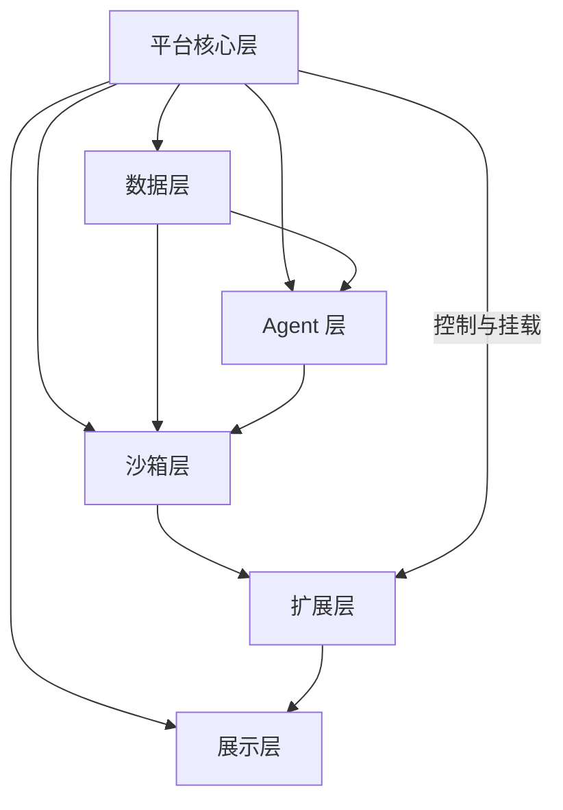

# 6.平台架构与边界框架

- 版本：`v0.1.0`
- 更新日期：`2026-04-09`
- 文档状态：`首版桥接文档`
- 文档定位：本文档用于把 `5.语义状态Agent设计哲学.md` 的设计哲学，桥接到 `0.需求说明.md` 和 `3.Agent 产品方案.md` 的产品结构中。本文档描述平台的宏观分层、边界关系、控制关系和运行关系，不讨论字段、表结构、接口细节和开发排期。

## 1. 文档目的

本文档解决的是一个中间层问题：

- 设计哲学已经明确了平台、Agent、沙箱和扩展能力的上位原则
- 需求说明已经明确了产品边界和功能方向
- Agent 产品方案已经明确了 Agent 体系和阶段路线

但这三者之间仍然需要一份更偏产品架构视角的桥接文档，回答下面的问题：

- 平台核心、数据层、Agent 层、沙箱层、扩展层、展示层的关系到底是什么
- 哪一层负责稳定，哪一层负责增长，哪一层负责交付
- 哪些能力属于平台固有能力，哪些能力属于 Agent 生成能力
- 平台应如何在“可持续生长”和“长期稳定”之间保持平衡

## 2. 总体框架

从平台视角看，`TweetPilot` 应被理解为一个六层系统：

1. 平台核心层
2. 数据层
3. Agent 层
4. 沙箱层
5. 扩展层
6. 展示层

这六层不是并列堆叠关系，而是有明确职责分工和控制边界的系统结构。

这个结构的核心思想是：

- 平台核心提供稳定宿主
- 数据层提供长期资产
- Agent 层负责理解与生成
- 沙箱层负责受控承载
- 扩展层负责承接新能力
- 展示层负责把能力变成可见结果

## 3. 平台核心层

平台核心层是整个系统的稳定中心。

它不追求快速变化，而追求长期可控。

它负责：

- 客户与账号管理
- 统一权限控制
- 统一审计控制
- 统一调度能力
- 统一菜单与界面宿主
- 统一能力网关
- 统一模型管理与模型路由基础能力
- 统一内容与素材资产宿主
- 统一生命周期管理
- 统一扩展能力挂载控制

平台核心层的职责不是替 Agent 完成所有高阶业务逻辑，而是确保系统具备一个始终稳定、始终可追溯、始终可控制的基础宿主。

平台核心层不应该被 Agent 直接改写。

## 4. 数据层

数据层是平台真正的长期资产层。

它承载两类数据：

- 原始事实数据
- 结构化运营状态数据

原始事实数据用于回答“发生了什么”。

结构化运营状态数据用于回答“这些事实意味着什么”。

数据层在整个系统中的角色，是让平台从“临时做判断”升级为“基于长期积累做判断”。

这层不只承载互动和任务数据，也承载内容草稿、生成素材、发布版本以及后续复用所需的内容资产。

因此，数据层不是一个被动存储区，而是平台智能能力的基础输入层。

平台越长期运行，这一层的价值越大。

## 5. Agent 层

Agent 层不是平台本身，而是平台上的理解与生成层。

它的职责不是维护平台稳定，而是基于平台已有资产和边界进行：

- 理解
- 分析
- 组合
- 判断
- 建议
- 执行
- 生成功能

这意味着 Agent 层有两类产出：

### 第一类产出：直接业务结果

例如：

- 回复建议
- 发帖建议
- 增长建议
- 风险结论
- 客户周报摘要

### 第二类产出：可持续能力

例如：

- 新报表
- 新分析视角
- 新策略逻辑
- 新定时任务
- 新功能入口

也就是说，Agent 层不只处理当前任务，还应有能力把高级结果沉淀为长期能力。

## 6. 沙箱层

沙箱层是平台可持续生长的关键边界。

它存在的目的不是让系统变成一个无边界代码执行平台，而是为 Agent 生成的新能力提供受控运行环境。

沙箱层的职责包括：

- 为新能力提供独立承载空间
- 保证新能力与平台核心隔离
- 防止新能力错误影响平台整体稳定性
- 为平台提供对新能力的启停、替换和移除能力

从产品架构上看，沙箱层是“生长空间”，不是“核心宿主”。

它必须服从平台核心层的控制。

## 7. 扩展层

扩展层承接的是 Agent 生成后的长期能力。

它不是一次性运行结果，也不是会话输出缓存。

它是一类正式产品对象，代表平台中“后来长出来的能力”。

扩展层中承载的能力，可以表现为：

- 报表扩展
- 分析扩展
- 策略扩展
- 定时任务扩展
- 功能入口扩展

扩展层与 Agent 层的区别在于：

- Agent 层负责生成
- 扩展层负责承接与存在

扩展层与沙箱层的区别在于：

- 沙箱层是运行边界
- 扩展层是能力对象

扩展层与平台核心层的区别在于：

- 平台核心层是系统固有能力
- 扩展层是系统后天长出的能力

## 8. 展示层

展示层负责把平台能力和扩展能力变成用户可见、可操作、可理解的结果。

它既服务基础功能，也服务扩展功能。

它的职责包括：

- 菜单呈现
- 面板呈现
- 报表呈现
- 任务呈现
- 状态呈现
- 扩展功能入口呈现
- 结果刷新入口呈现

展示层不是被动 UI。

它是平台交付能力的正式组成部分，因为客户最终买的不是内部逻辑，而是可见、可用、可交付的结果。

## 9. 六层之间的关系

## 9.1 平台核心层与数据层

平台核心层管理数据层，但不等于数据层。

平台核心层定义：

- 哪些数据是平台事实
- 哪些数据是平台状态
- 哪些数据可以被长期保留
- 哪些数据可以被开放给 Agent 和沙箱

数据层负责承载这些资产。

## 9.2 数据层与 Agent 层

数据层为 Agent 层提供高质量输入。

没有数据层，Agent 只能做临时推理。

有了数据层，Agent 可以在更高语义层级工作。

这就是 `TweetPilot` 与传统 Agent 产品的重要差别。

## 9.3 Agent 层与沙箱层

Agent 层负责生成新能力，沙箱层负责承载新能力。

两者缺一不可：

- 没有 Agent，系统不会主动长出新能力
- 没有沙箱，新能力会直接污染平台核心

## 9.4 沙箱层与扩展层

沙箱层和扩展层不是同一个概念。

- 沙箱层定义运行边界
- 扩展层定义能力对象

可以理解为：

- 沙箱是土壤
- 扩展是长出来的植物

## 9.5 扩展层与展示层

扩展层里的能力要真正变成产品的一部分，必须经过展示层。

没有展示层，扩展能力只是存在；有了展示层，扩展能力才变成客户可见、可用、可交付的功能。

## 10. 关键控制关系

## 10.1 平台核心控制系统稳定性

平台核心拥有最终控制权，负责决定：

- 哪些能力可以进入沙箱
- 哪些扩展可以被挂载到主界面
- 哪些扩展可以自动运行
- 哪些扩展只允许人工触发
- 哪些能力可跨客户、跨账号、跨数据边界工作

这条原则不能被削弱。

## 10.2 数据层控制可信事实

平台事实和平台状态是系统可信来源。

沙箱和扩展可以读取这些内容，但不应反向污染平台核心事实。

这是防止系统边界失控的关键。

## 10.3 Agent 层控制能力生成

Agent 控制的是“如何理解和生成”，不是“是否拥有最终控制权”。

Agent 可以生成：

- 建议
- 内容
- 逻辑
- 扩展能力

但最终是否进入长期产品状态，仍由平台决定。

## 10.4 沙箱层控制风险隔离

沙箱层控制的是风险边界。

平台允许增长，但不允许增长以破坏稳定性为代价。

这就是沙箱层的产品意义。

## 10.5 展示层控制交付形态

同一项扩展能力，是否值得长期保留，很大程度上取决于它是否被展示层转化成了真正有价值的客户结果。

因此，展示层不只是“显示界面”，它也是平台筛选和固化能力的重要一环。

## 11. 平台中的三类能力

为了保持系统结构清晰，平台中的能力应至少分成三类：

## 11.1 固有能力

这是平台出厂就具备、由平台核心长期维护的能力。

例如：

- 基础 Twitter 能力
- 基础数据采集能力
- 基础内容与素材管理能力
- 基础模型管理能力
- 基础报表能力
- 基础任务调度能力
- 基础展示能力

## 11.2 编排能力

这是 Agent 对固有能力进行理解、组合和决策时体现出的能力。

例如：

- 回复判断
- 风险判断
- 模型路由判断
- 通道选择判断
- 策略生成判断

## 11.3 扩展能力

这是 Agent 在平台边界内生成并由沙箱承载、最终被平台保留的能力。

例如：

- 客户专属报表
- 客户专属分析视角
- 客户专属策略逻辑
- 客户专属定时任务
- 客户专属功能入口

这三类能力必须被清楚区分，否则系统最终会混成一个不可控整体。

## 12. 为什么这份桥接文档重要

如果没有这份桥接文档，系统很容易出现两种偏差：

### 偏差一：只谈哲学，不落产品结构

这会导致团队理解方向对，但在产品拆分上失去一致性。

### 偏差二：只谈需求，不守边界原则

这会导致功能越做越多，但平台核心、Agent、沙箱、扩展能力之间的关系越来越混乱。

桥接文档的作用，就是让平台在“设计哲学”与“功能需求”之间保持结构一致。

## 13. 当前结论

`TweetPilot` 的平台结构应被理解为：

- 平台核心层：负责稳定与控制
- 数据层：负责沉淀事实与状态
- Agent 层：负责理解、生成与编排
- 沙箱层：负责受控承载
- 扩展层：负责长期保留新能力
- 展示层：负责交付和呈现结果

这六层共同构成了 `TweetPilot` 的宏观架构边界。

只有把这六层的关系定义清楚，后续需求说明、Agent 方案、技术方案和商业表达才能长期保持一致。
