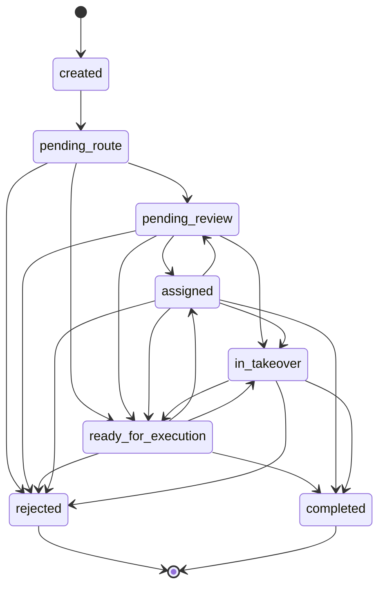

# T4-00: 任务对象与治理状态基础

- 版本: `v0.2.1`
- 创建日期: `2026-04-10`
- 文档状态: `草稿`
- 对应切片: Slice 4 - 风险分流与审核队列
- 前置依赖: `T3-02`, `T3-03`, `T3-04`

## 1. 任务目标

建立 Slice 4 的统一任务模型，让候选回复后续发生的分流、审核、指派和接管动作都围绕同一个 `ReplyTask` 平台对象展开，并明确状态转换规则、最小审计事件和统一错误边界。

## 2. 核心交付物

### 2.1 领域对象

- `src/domain/replyTask.ts`
- `ReplyTask`
- `ReplyTaskStatus`
- `ReplyTaskRoute`
- `ReplyTaskEvent`

```typescript
export type ReplyTaskStatus =
  | "created"
  | "pending_route"
  | "pending_review"
  | "ready_for_execution"
  | "assigned"
  | "in_takeover"
  | "rejected"
  | "completed";

export interface ReplyTaskEvent {
  id: string;
  taskId: string;
  type:
    | "task_created"
    | "risk_routed"
    | "review_requested"
    | "review_decided"
    | "task_assigned"
    | "task_taken_over"
    | "task_completed"
    | "task_failed";
  actorId: string;
  createdAt: Date;
  payload?: Record<string, unknown>;
}

export interface ReplyTask {
  id: string;
  workspaceId: string;
  accountId: string;
  commentInputId: string;
  candidateReplyId: string;
  roleId?: string;
  riskLevel: "low" | "medium" | "high";
  route: "pending_review" | "ready_for_execution";
  status: ReplyTaskStatus;
  assigneeId?: string;
  takenOverBy?: string;
  events: ReplyTaskEvent[];
  createdAt: Date;
  updatedAt: Date;
}

export const VALID_STATUS_TRANSITIONS: Record<ReplyTaskStatus, ReplyTaskStatus[]> = {
  created: ["pending_route"],
  pending_route: ["pending_review", "ready_for_execution", "rejected"],
  pending_review: ["assigned", "in_takeover", "ready_for_execution", "rejected"],
  ready_for_execution: ["assigned", "in_takeover", "completed", "rejected"],
  assigned: ["pending_review", "in_takeover", "ready_for_execution", "completed", "rejected"],
  in_takeover: ["ready_for_execution", "completed", "rejected"],
  rejected: [],
  completed: [],
};
```

### 2.1.1 状态转换可视化

为避免状态矩阵只停留在代码表结构，本任务要求同步维护一份状态图，作为开发和评审时的快速校验视图。



### 2.2 仓储接口

- `src/data/repositories/IReplyTaskRepository.ts`
- `src/data/repositories/InMemoryReplyTaskRepository.ts`

```typescript
export interface IReplyTaskRepository {
  save(task: ReplyTask): Promise<void>;
  findById(id: string): Promise<ReplyTask | null>;
  findByCandidateReplyId(candidateReplyId: string): Promise<ReplyTask | null>;
  findByWorkspace(workspaceId: string): Promise<ReplyTask[]>;
  findByStatus(status: ReplyTaskStatus): Promise<ReplyTask[]>;
  findPendingReview(): Promise<ReplyTask[]>;
  findEvents(taskId: string): Promise<ReplyTaskEvent[]>;
}
```

### 2.3 服务层

- 本任务只建立工厂函数和状态迁移辅助方法，不新增独立应用服务。
- 在 `src/domain/replyTask.ts` 中提供 `createReplyTask()`、`appendReplyTaskEvent()`、`markReplyTaskStatus()`、`assertCanTransition()` 等纯函数。
- 明确 `ReplyTask` 是 Slice 4 的聚合根，后续审核、指派和接管只能通过聚合根方法修改状态和事件。

### 2.4 错误处理策略

- `src/domain/errors.ts`
- `ReplyTaskDomainError`
- 错误码约定：
  - `INVALID_TASK_STATUS_TRANSITION`
  - `TASK_NOT_FOUND`
  - `TASK_EVENT_APPEND_FAILED`

要求：

- 领域层抛出结构化错误码，不使用无语义的裸 `Error`。
- 服务层只传播结构化错误，不在任务卡里引入页面级吞错逻辑。

### 2.5 UI 组件

- 本任务不新增 UI 组件。
- 仅在后续任务中复用本任务定义的状态和值对象。

## 3. 实施步骤

1. 盘点 Slice 3 现有 `CandidateReply` 字段，确定任务对象必须继承的归属关系和风险字段。
2. 定义 `ReplyTask`、任务状态、路由枚举和最小任务事件结构，去掉语义重复的 `approved` 中间状态。
3. 明确定义 `VALID_STATUS_TRANSITIONS`，把合法状态跳转写成可测试规则。
4. 同步维护 Mermaid 状态图，确保图示与转换矩阵一致。
5. 实现 `IReplyTaskRepository` 与 `InMemoryReplyTaskRepository`，确保支持基础查询、事件查询和审核队列读取。
6. 补齐工厂函数、状态迁移辅助方法和结构化错误类型。
7. 为任务对象、仓储和状态迁移补齐单元测试与集成测试。

## 4. 验收标准

- [ ] `ReplyTask` 能表达评论输入、候选回复、账号、角色、工作区、风险、状态和责任归属。
- [ ] 任务事件结构能承接后续审核、指派和接管的最小审计记录。
- [ ] 内存仓储支持按状态和待审核任务读取。
- [ ] 状态迁移辅助方法会基于显式转换矩阵拦截非法状态跳转。
- [ ] Mermaid 状态图与 `VALID_STATUS_TRANSITIONS` 保持一致。
- [ ] `ReplyTask` 被明确为 Slice 4 的聚合根。
- [ ] 任务事件支持最小审计查询，不需要额外搭建独立审计系统。

## 5. 测试要求

### 5.1 单元测试

- 验证 `createReplyTask()` 创建出的对象字段完整。
- 验证 `appendReplyTaskEvent()` 能追加事件并更新时间。
- 验证从 `created -> pending_route`、`pending_route -> pending_review`、`pending_review -> ready_for_execution` 等合法转换可通过。
- 验证 `completed -> pending_review`、`rejected -> ready_for_execution` 等非法状态跳转会抛出 `INVALID_TASK_STATUS_TRANSITION`。
- 验证任务事件默认按时间追加而非覆盖。
- 验证 `task_completed`、`task_failed` 事件可被正确追加。

### 5.2 集成测试

- 验证 `InMemoryReplyTaskRepository` 的保存、查询、按状态过滤和待审核读取。
- 验证按 `candidateReplyId` 可回查到任务对象。
- 验证 `findEvents(taskId)` 能返回完整事件历史。
- 验证任务保存后再次读取时事件与状态保持一致。

## 6. 时间估算

- 开发时间: `5-6 小时`
- 测试时间: `2 小时`
- 总计: `7-8 小时`

## 7. 依赖关系

**前置依赖**:

- `T3-02` 候选回复结果对象与仓储
- `T3-03` Reply Agent 上下文组装与候选回复生成
- `T3-04` 候选回复展示界面与生成追踪

**后续任务**:

- `T4-01` 候选回复任务化与创建服务
- `T4-02` 风险分流规则与任务路由
- `T4-03` 审核队列读取与审核动作
- `T4-04` 责任归属、人工接管与治理回写
