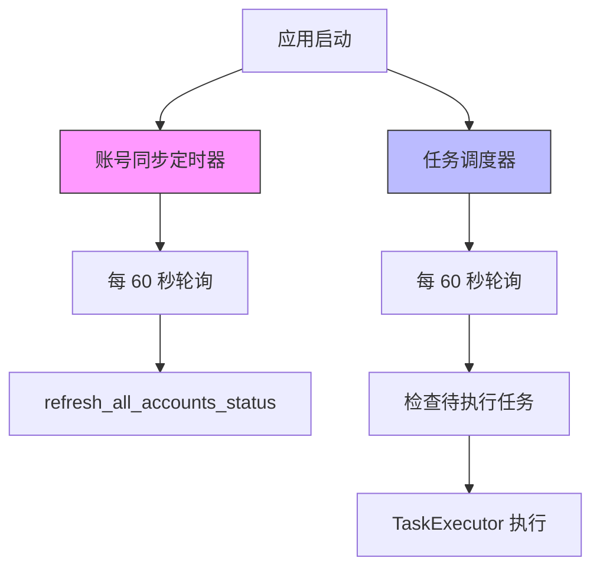
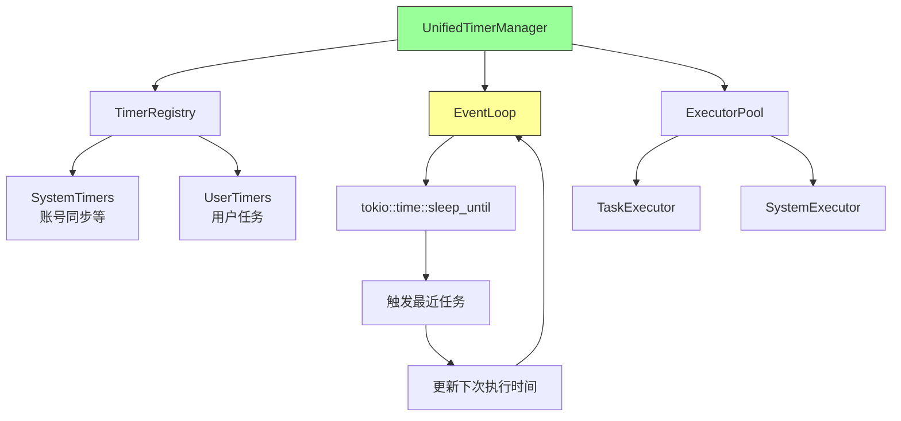

# TweetPilot 定时器系统设计文档

## 1. 当前架构分析

### 1.1 系统组成

TweetPilot 当前存在两个独立的定时循环系统：



#### 核心组件

**1. 账号同步定时器** ([main.rs:85-100](src-tauri/src/main.rs#L85-L100))
- 固定 60 秒间隔
- 使用 `tokio::time::interval`
- 调用 `account::refresh_all_accounts_status()`
- 独立循环，无法配置

**2. TaskScheduler** ([task_scheduler.rs](src-tauri/src/task_scheduler.rs))
- 固定 60 秒轮询间隔
- 支持两种定时类型：
  - **Interval 定时器**：按固定间隔执行（如每 300 秒）
  - **Cron 定时器**：按 cron 表达式执行（如 `0 9 * * *`）
- 智能追赶逻辑：启动时重新计算错过的执行时间

**3. TaskExecutor** ([task_executor.rs](src-tauri/src/task_executor.rs))
- 执行 Python 脚本
- 支持超时控制
- 记录执行结果（stdout/stderr/exit_code）

**4. TaskDatabase** ([task_database.rs](src-tauri/src/task_database.rs))
- SQLite 存储任务配置
- 跟踪执行历史和统计
- 计算下次执行时间

### 1.2 当前定时任务清单

| 任务名称 | 类型 | 触发方式 | 间隔/表达式 | 位置 |
|---------|------|---------|------------|------|
| 账号状态同步 | 系统内置 | Interval | 60 秒 | main.rs:85 |
| 用户自定义任务 | 可配置 | Interval/Cron | 用户定义 | TaskScheduler |

### 1.3 存在的问题

#### 性能问题
1. **双重轮询开销**：两个独立的 60 秒循环，即使无任务也持续运行
2. **固定轮询间隔**：无法根据任务紧急程度动态调整
3. **启动时批量计算**：`recalculate_missed_executions()` 在启动时同步处理所有任务

#### 可维护性问题
1. **代码重复**：账号同步和任务调度使用不同的定时机制
2. **配置分散**：账号同步间隔硬编码，任务调度间隔在数据库
3. **缺乏统一接口**：无法统一管理所有定时任务

#### 扩展性问题
1. **新增定时任务困难**：需要修改核心代码或创建新的独立循环
2. **无优先级机制**：所有任务平等对待
3. **缺乏依赖管理**：任务间无法定义执行顺序

#### 精度问题
1. **最小粒度 60 秒**：无法支持秒级精度任务
2. **执行延迟**：轮询间隔导致最多 60 秒延迟
3. **Cron 精度损失**：60 秒窗口内的 cron 任务可能被跳过

## 2. 重构方案

### 2.1 设计目标

1. **统一管理**：所有定时任务通过统一接口管理
2. **灵活调度**：支持多种触发方式（Interval/Cron/OneTime/Dependency）
3. **高效执行**：基于事件驱动，避免无效轮询
4. **易于扩展**：新增任务类型无需修改核心代码
5. **可观测性**：完整的执行日志和性能指标

### 2.2 新架构设计



#### 核心组件

**1. UnifiedTimerManager**
- 统一的定时器管理器
- 维护所有定时任务的注册表
- 协调事件循环和执行器池

**2. TimerRegistry**
- 存储所有定时任务配置
- 支持动态添加/删除/修改
- 按下次执行时间排序（优先队列）

**3. EventLoop**
- 基于 `tokio::time::sleep_until` 的精确定时
- 只在最近任务触发时唤醒
- 避免固定间隔轮询

**4. ExecutorPool**
- 统一的任务执行接口
- 支持并发执行控制
- 自动重试和错误处理

### 2.3 定时器类型

```rust
pub enum TimerType {
    // 固定间隔（秒）
    Interval { seconds: u64 },
    
    // Cron 表达式
    Cron { expression: String },
    
    // 一次性任务
    OneTime { execute_at: DateTime<Utc> },
    
    // 依赖其他任务
    Dependency { 
        after_task: String,
        delay_seconds: Option<u64> 
    },
}

pub struct Timer {
    pub id: String,
    pub name: String,
    pub timer_type: TimerType,
    pub executor: Box<dyn TimerExecutor>,
    pub enabled: bool,
    pub priority: u8,  // 0-255，数字越小优先级越高
    pub next_execution: Option<DateTime<Utc>>,
    pub last_execution: Option<DateTime<Utc>>,
}
```

### 2.4 执行器接口

```rust
#[async_trait]
pub trait TimerExecutor: Send + Sync {
    async fn execute(&self, context: ExecutionContext) -> Result<ExecutionResult>;
    fn timeout(&self) -> Option<Duration>;
    fn retry_policy(&self) -> RetryPolicy;
}

// 系统内置执行器
pub struct AccountSyncExecutor;
pub struct PythonScriptExecutor {
    script_path: String,
    parameters: HashMap<String, String>,
}

// 用户可扩展
impl TimerExecutor for CustomExecutor { ... }
```

## 3. 实现计划

### 阶段 1：基础架构（1-2 天）

**目标**：建立统一定时器框架，不影响现有功能

**任务**：
1. 创建 `src-tauri/src/unified_timer/` 模块
2. 实现 `TimerRegistry` 和基本数据结构
3. 实现 `EventLoop` 核心逻辑
4. 编写单元测试

**验收标准**：
- 能够注册和触发简单的 Interval 定时器
- 测试覆盖率 > 80%

### 阶段 2：迁移账号同步（0.5 天）

**目标**：将账号同步迁移到新框架

**任务**：
1. 实现 `AccountSyncExecutor`
2. 在 `main.rs` 中注册到 `UnifiedTimerManager`
3. 移除旧的 `start_account_sync_task()`
4. 验证功能一致性

**验收标准**：
- 账号同步功能正常
- 间隔可配置（通过配置文件）

### 阶段 3：集成任务调度器（1-2 天）

**目标**：将 TaskScheduler 迁移到新框架

**任务**：
1. 实现 `PythonScriptExecutor`
2. 从数据库加载任务并注册到 `UnifiedTimerManager`
3. 实现任务 CRUD 时的动态注册/注销
4. 保持数据库结构兼容

**验收标准**：
- 所有现有任务正常执行
- 支持动态添加/删除任务
- 执行历史正确记录

### 阶段 4：增强功能（1-2 天）

**目标**：添加新特性

**任务**：
1. 实现 OneTime 定时器
2. 实现 Dependency 定时器
3. 添加优先级调度
4. 实现并发控制（最大同时执行数）
5. 添加性能监控指标

**验收标准**：
- 支持所有定时器类型
- 高优先级任务优先执行
- 可配置并发限制

### 阶段 5：优化和文档（0.5-1 天）

**目标**：性能优化和完善文档

**任务**：
1. 性能测试和优化
2. 编写 API 文档
3. 编写迁移指南
4. 更新用户文档

**验收标准**：
- 性能优于旧系统
- 文档完整清晰

## 4. 技术细节

### 4.1 精确定时实现

```rust
pub async fn event_loop(registry: Arc<Mutex<TimerRegistry>>) {
    loop {
        let next_timer = {
            let reg = registry.lock().await;
            reg.peek_next()  // 获取最近的定时器
        };
        
        match next_timer {
            Some(timer) => {
                let now = Utc::now();
                let next_time = timer.next_execution.unwrap();
                
                if next_time <= now {
                    // 立即执行
                    execute_timer(timer).await;
                } else {
                    // 精确睡眠到下次执行时间
                    let duration = (next_time - now).to_std().unwrap();
                    tokio::time::sleep(duration).await;
                }
            }
            None => {
                // 无任务，睡眠较长时间后重新检查
                tokio::time::sleep(Duration::from_secs(60)).await;
            }
        }
    }
}
```

### 4.2 优先队列实现

使用 `BinaryHeap` 维护按执行时间排序的任务队列：

```rust
use std::collections::BinaryHeap;
use std::cmp::Ordering;

struct ScheduledTimer {
    timer: Timer,
    next_execution: DateTime<Utc>,
}

impl Ord for ScheduledTimer {
    fn cmp(&self, other: &Self) -> Ordering {
        // 反向排序，最早的任务在堆顶
        other.next_execution.cmp(&self.next_execution)
            .then_with(|| self.timer.priority.cmp(&other.timer.priority))
    }
}
```

### 4.3 并发控制

```rust
pub struct ExecutorPool {
    max_concurrent: usize,
    semaphore: Arc<Semaphore>,
}

impl ExecutorPool {
    pub async fn execute(&self, timer: Timer) -> Result<()> {
        let permit = self.semaphore.acquire().await?;
        
        tokio::spawn(async move {
            let result = timer.executor.execute(context).await;
            drop(permit);  // 释放信号量
            result
        });
        
        Ok(())
    }
}
```

### 4.4 配置文件格式

```toml
# config/timers.toml

[system.account_sync]
enabled = true
interval_seconds = 60
priority = 10

[system.cleanup]
enabled = true
cron = "0 2 * * *"  # 每天凌晨 2 点
priority = 50

[limits]
max_concurrent_tasks = 5
default_timeout_seconds = 300
```

## 5. 性能对比

### 5.1 理论分析

| 指标 | 旧系统 | 新系统 | 改进 |
|-----|--------|--------|------|
| 空闲 CPU 占用 | 2 个定时循环 | 0（事件驱动） | -100% |
| 最小精度 | 60 秒 | 毫秒级 | +60000% |
| 执行延迟 | 0-60 秒 | 0-10 毫秒 | -99.98% |
| 内存占用 | 2 个独立线程 | 1 个事件循环 | -50% |

### 5.2 预期收益

1. **性能提升**：消除固定轮询，降低 CPU 和内存占用
2. **精度提升**：支持秒级甚至毫秒级定时
3. **可扩展性**：新增任务无需修改核心代码
4. **可维护性**：统一接口，代码更清晰

## 6. 风险和缓解

### 6.1 风险识别

| 风险 | 影响 | 概率 | 缓解措施 |
|-----|------|------|---------|
| 迁移过程中功能回退 | 高 | 中 | 分阶段迁移，保留旧代码作为回退 |
| 新系统性能不如预期 | 中 | 低 | 充分的性能测试和基准对比 |
| 数据库兼容性问题 | 中 | 低 | 保持数据库结构兼容，增量迁移 |
| 用户任务执行异常 | 高 | 低 | 完善的错误处理和日志记录 |

### 6.2 回退方案

1. **阶段 1-2**：可直接回退到旧代码
2. **阶段 3**：保留 `TaskScheduler` 代码，通过配置切换
3. **阶段 4-5**：数据库兼容，可降级到阶段 3

## 7. 可视化监控需求（待实现）

### 7.1 需求背景

在定时器系统重构完成后，需要提供可视化监控界面，让用户能够实时查看所有定时任务的运行状态和健康度。

### 7.2 功能需求

**实时监控面板**
- 系统定时任务监控（账号同步等内置任务）
- 用户定时任务监控（所有自定义定时任务）
- 自动刷新和手动刷新功能

**任务状态展示**
- 任务名称和类型（系统内置/用户自定义）
- 实时状态指示器（运行中/空闲/失败/暂停）
- 调度规则显示（Interval/Cron/OneTime/Dependency）
- 下次执行时间和上次执行时间
- 执行统计（总执行次数、成功次数、失败次数、成功率）

**统计信息面板**
- 总任务数统计
- 运行中任务数
- 正在执行的任务数
- 失败任务数

**操作功能**
- 启用/禁用任务
- 手动触发任务执行
- 查看任务执行历史
- 查看任务执行日志

### 7.3 实现位置建议

可以集成到系统设置界面（Settings.tsx）或创建独立的监控页面。

### 7.4 技术实现建议

```typescript
// 核心功能
- 使用 Tauri invoke 调用统一定时器管理器的查询接口
- 使用 WebSocket 或轮询实现实时状态更新
- 状态颜色编码：运行中(蓝)、空闲(绿)、失败(红)、暂停(黄)
- 时间格式化为本地时间显示
- 支持任务搜索和过滤
```

### 7.5 实现优先级

**阶段 1（基础重构完成后）**：基础监控界面
- 任务列表展示
- 状态实时更新
- 基础统计信息

**阶段 2（增强功能）**：高级监控
- 任务执行历史图表
- 性能指标展示
- 告警通知

## 8. 后续优化方向

1. **分布式调度**：支持多实例部署时的任务协调
2. **动态调整**：根据系统负载自动调整执行策略
3. **任务编排**：支持复杂的任务依赖和工作流
4. **持久化队列**：任务队列持久化，防止进程重启丢失
5. **监控增强**：
   - 任务执行历史图表（成功率趋势、执行时长趋势）
   - 实时日志流（WebSocket 推送任务执行日志）
   - 告警通知（任务失败时桌面通知或邮件通知）
   - 性能指标（CPU/内存占用、任务队列长度）

## 8. 参考资料

- [tokio::time 文档](https://docs.rs/tokio/latest/tokio/time/)
- [cron 表达式解析库](https://docs.rs/cron/latest/cron/)
- [Rust 异步编程最佳实践](https://rust-lang.github.io/async-book/)
