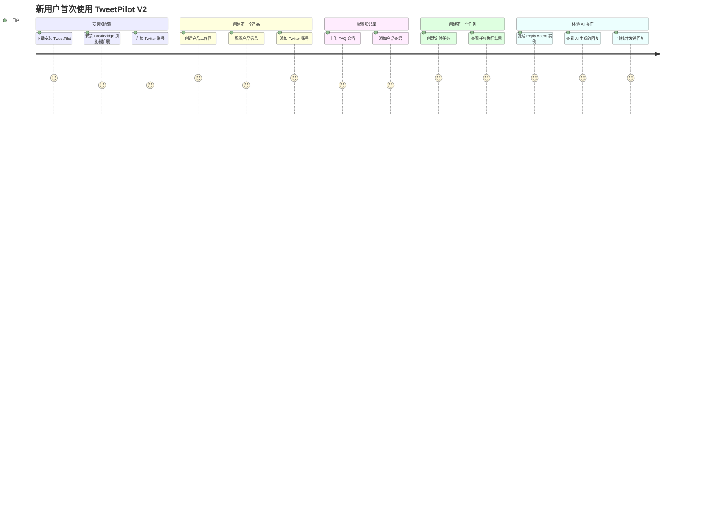
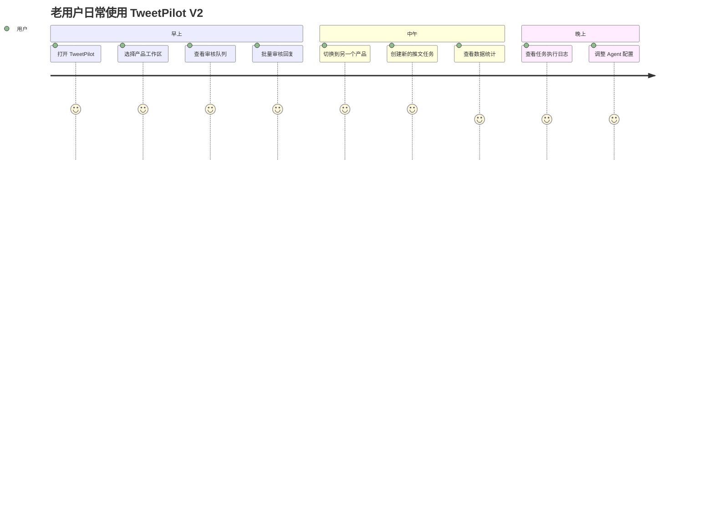

# TweetPilot V2 产品需求总纲

## 文档信息
- 版本：v2.1.0
- 创建日期：2026-04-12
- 最后更新：2026-04-13
- 文档状态：评审问题修复完成
- 负责人：产品团队

## 1. 产品定位

### 1.1 一句话定义

**TweetPilot 是一个 Twitter 自动化运营 Agent 平台，为用户创造虚拟的 AI 运维团队，通过数据积木让用户自由组合创造独有的运营功能，企业版提供沙箱能力支持高级定制。**

### 1.2 设计哲学：数据积木 + AI + 沙箱

**核心理念**：数据积木 + AI 推理 + 沙箱能力 = 用户创造独有功能

**数据积木（Data Blocks）**：半成品数据，介于原始数据和最终数据之间。已精炼、已结构化，但保留灵活性，用户完全控制，可任意加工组合。

**具体示例**：
- **原始数据**：推文 JSON（包含 100+ 字段：id, text, author, created_at, metrics, entities...）
- **数据积木**："高互动评论列表"（已过滤 likes>10、已排序、已标注情感、已提取关键词）
- **最终数据**：AI 生成的个性化回复文本

**设计哲学**：传统软件是完成品，开发者预设所有功能，用户只能被动使用。当前的大模型应用是从原始数据中像大海捞针一样，从海量数据中寻找有价值的数据资产，成本高、收益低、重复逻辑的 token 消耗、上下文受限、容易出现幻觉。TweetPilot 存储结构化的原始数据（推文、评论、用户、互动）并提供原始数据的初级加工，生成数据积木，用户在沙箱中结合 AI 推理能力自由组合，创造独有的功能模块。这是软件从"产品"到"平台"的转变，用户从"使用者"变为"创造者"。

### 1.3 核心价值主张

**为谁**：
- 一人公司和独立开发者（主要用户）
- Web3/AI/SaaS 创业团队
- Twitter 代运营公司
- 大企业的社媒运营团队

**解决什么问题**：
- Twitter 运营工作重复繁琐，占用大量时间
- 多个产品的运营数据和知识混乱，难以管理
- 缺少专业的运营团队，但又需要保持 Twitter 活跃度
- 现有工具要么功能简单，要么过于复杂难以上手

**提供什么价值**：
- **虚拟 AI 运维团队**：为用户创造虚拟的 AI 运维团队，自动化处理重复性工作
- **数据积木**：提供半成品数据，用户可以通过 UI 自由组合查看和分析，创造独有的数据视图和报表
- **沙箱能力**（企业版）：高级用户可以编写自定义代码，创建完全定制的逻辑 + 数据 + 展示功能区
- **产品中心化**：类似 IDE 的工作区体验，每个产品独立管理
- **本地优先**：数据存储在本地，隐私安全可控
- **灵活定价**：提供免费版、个人版、企业版，满足不同规模用户需求

### 1.4 与竞品的差异化

| 维度 | TweetPilot V2 | Buffer/Hootsuite | Typefully | 自建脚本 |
|------|--------------|------------------|-----------|---------|
| **产品中心化** | ✅ 类似 IDE 工作区 | ❌ 账号中心化 | ❌ 账号中心化 | ❌ 无组织 |
| **模块化架构** | ✅ 功能模块独立 | ❌ 一体化 | ❌ 一体化 | ✅ 自己组合 |
| **AI 协作** | ✅ Claurst Agent | ❌ 无 | ⚠️ 简单 AI | ❌ 无 |
| **本地优先** | ✅ 数据本地存储 | ❌ 云端 | ❌ 云端 | ✅ 本地 |
| **沙箱能力** | ✅ 用户可创造功能 | ❌ 无 | ❌ 无 | ⚠️ 需自己开发 |
| **数据所有权** | ✅ 用户完全控制 | ❌ 平台控制 | ❌ 平台控制 | ✅ 用户控制 |
| **浏览器扩展** | ✅ 免费提供 | ❌ 无 | ❌ 无 | ❌ 需自建 |
| **上手难度** | ⚠️ 中等 | ✅ 简单 | ✅ 简单 | ❌ 困难 |
| **定价模式** | ✅ 免费版 + 付费版 | ❌ 纯订阅制 | ❌ 纯订阅制 | ✅ 免费 |

**核心差异化**：
1. **AI 时代的软件新范式**：数据积木 + AI 推理 = 用户通过 UI 组合创造独有功能，企业版可通过沙箱编写代码实现完全定制
2. **虚拟 AI 运维团队**：为用户创造虚拟的 AI 运维团队（市场首创）
3. **数据积木**：提供半成品数据，所有版本用户都可以通过 UI 自由组合查看和分析
4. **沙箱能力**（企业版）：高级用户可以编写自定义代码，创建完全定制的功能区
5. **灵活的 Twitter 访问方案**：
   - **自研方案**：免费的浏览器扩展 + LocalBridge（成本优先，个人和小团队）
   - **官方方案**：支持切换到官方 Twitter MCP 服务（稳定性优先，企业级）

### 1.5 商业模式

#### 1.5.1 版本定价

| 版本 | 定价 | 目标用户 | 核心价值 |
|------|------|---------|---------|
| **免费版** | $0/月 | 个人用户、试用用户 | 数据积木展示、基础数据报表、单产品管理 |
| **个人版** | $29/月 或 $290/年 | 独立开发者、一人公司 | 多产品管理、AI 协作、自动化 |
| **企业版** | $99/月 或 $990/年（每席位） | 创业团队、代运营公司 | 团队协作、高级 AI、数据分析 |

#### 1.5.2 重要说明：第三方服务费用

TweetPilot 定价仅针对软件平台本身，不包含第三方服务费用（AI 大模型、Twitter MCP 服务），用户需自行承担。

**AI 大模型费用估算**（基于 Claude Sonnet 3.5）：
- 轻度使用（每天 10 次 AI 回复）：约 $5-10/月
- 中度使用（每天 30 次 AI 回复）：约 $15-25/月
- 重度使用（每天 100 次 AI 回复）：约 $50-80/月

**说明**：实际费用取决于使用的模型（Haiku 更便宜，Opus 更贵）、回复长度、知识库大小等因素。建议用户在 AI 提供商后台设置月度预算上限。

#### 1.5.3 功能分级（免费版 vs 个人版 vs 企业版）

**核心功能对比**：

| 功能模块 | 免费版 | 个人版 | 企业版 |
|---------|--------|--------|--------|
| **产品工作区数量** | 1 个 | 无限制 | 无限制 |
| **Twitter 账号数量** | 1 个 | 5 个 | 无限制 |
| **Twitter 访问方案** | 自研方案（LocalBridge） | 自研方案（LocalBridge） | 自研方案 + 官方 MCP（可切换） |
| **本地数据存储** | ✅ | ✅ | ✅ |
| **即时任务** | ✅ | ✅ | ✅ |
| **定时任务** | ❌ | ✅ | ✅ |
| **产品知识库** | ❌ | ✅ | ✅ |
| **AI 自动回复（基础）** | ❌ | ✅ | ✅ |
| **AI 自动回复（高级）** | ❌ | ❌ | ✅ |
| **AI 内容生成** | ❌ | ✅ | ✅ |
| **审核队列** | ❌ | ✅ | ✅ |
| **数据统计（基础）** | ✅ | ✅ | ✅ |
| **数据统计（高级）** | ❌ | ❌ | ✅ |
| **团队协作** | ❌ | ❌ | ✅ |
| **权限管理** | ❌ | ❌ | ✅ |
| **API 访问** | ❌ | ❌ | ✅ |
| **优先支持** | ❌ | ❌ | ✅ |

**功能分级说明**：

**免费版（Free）**：体验产品核心价值，1 个产品工作区 + 1 个 Twitter 账号，适合个人试用。可以查看数据积木（推文、评论、用户互动数据的结构化展示）、查看基础数据报表（互动统计、趋势图表）、手动管理任务，但不包含 AI 自动化功能。

**个人版（Pro）**：无限产品工作区 + 5 个 Twitter 账号 + AI 协作 + 定时任务，适合独立开发者和一人公司。

**企业版（Enterprise）**：无限 Twitter 账号 + 团队协作 + 高级 AI + 官方 Twitter MCP，适合创业团队和代运营公司。

#### 1.5.4 收费策略升级方案

**阶段 1：最早期用户（10 个名额）**
- 终身免费使用个人版
- 目标：核心种子用户，深度参与产品打磨
- **资格认定**：产品发布后前 10 个注册并完成首次产品配置的用户（先到先得）

**阶段 2：Early Bird 用户（1000 个个人版 + 2 个企业版）**
- 个人版：终身 50% 折扣（$14.5/月 或 $145/年）
- 企业版：终身 50% 折扣（$49.5/月 或 $495/年）
- 目标：建立早期用户社区，验证产品价值
- **资格认定**：
  - 个人版：第 11-1010 个注册用户，且在注册后 30 天内至少使用产品 3 次
  - 企业版：前 2 个购买企业版的团队（需提交企业信息审核）
  - 防刷机制：每个邮箱/设备指纹只能注册一次，重复注册无效

**阶段 3：正式商业化**
- 启动标准定价，不再提供优惠
- 目标：可持续商业模式
- **启动条件**：Early Bird 名额用完或产品发布 6 个月后（以先到者为准）

**核心原则**：版本定价简单清晰，用户容易理解和选择。浏览器扩展 + LocalBridge 永久免费。第三方服务费用（AI 大模型、Twitter MCP）由用户自行承担。


## 2. 产品功能全景

### 2.1 功能模块清单

TweetPilot V2 采用 **UI 优先驱动、模块并行开发** 的模块化架构。首先设计和实现完整的 UI，然后由 UI 的需求定义接口，最后各模块独立开发，通过定义良好的接口与其他模块交互。

**Twitter 访问方案说明**：默认使用免费的浏览器扩展 + LocalBridge，企业版可切换到官方 Twitter MCP 服务（需自行申请 API 权限）。

| 模块名称 | 功能描述 | 优先级 | 版本限制 | 接口依赖 |
|---------|---------|--------|---------|---------|
| **LocalBridge HTTP Client 模块** | 封装 LocalBridge REST API 调用，提供类型安全接口（自研方案） | P0 | 所有版本 | 无（调用 LocalBridge REST API） |
| **Twitter MCP Client 模块** | 封装官方 Twitter MCP 服务调用（官方方案） | P1 | 企业版 | 无（调用官方 Twitter MCP） |
| **Twitter 访问抽象层** | 统一的 Twitter 访问接口，支持切换 LocalBridge 或官方 MCP | P0 | 所有版本 | ILocalBridgeClient, ITwitterMCPClient |
| **数据存储模块** | 存储推文、评论、用户等数据到本地数据库 | P0 | 所有版本 | ITwitterAccess |
| **任务管理模块（即时）** | 管理即时任务 | P0 | 所有版本 | ITwitterAccess, IDataStorage |
| **任务管理模块（定时）** | 管理定时任务 | P0 | 个人版+ | ITwitterAccess, IDataStorage |
| **产品管理模块** | 管理多个产品，产品中心化工作区 | P0 | 所有版本（免费版限 1 个产品） | IDataStorage |
| **知识库模块** | 管理产品专属知识库（FAQ、产品资料） | P1 | 个人版+ | IProductManagement |
| **Claurst Host Manager 模块（基础）** | 驱动 Claurst 进程，管理 Agent 任务执行（基础 AI） | P1 | 个人版+ | IProductManagement, IKnowledgeBase, ITaskManagement |
| **Claurst Host Manager 模块（高级）** | 高级 AI 能力（更强模型、更多并发） | P1 | 企业版 | IProductManagement, IKnowledgeBase, ITaskManagement |
| **MCP 服务器模块** | 提供 Twitter、知识库、数据访问的 MCP 接口 | P1 | 个人版+ | ITwitterAccess, IKnowledgeBase, IDataStorage |
| **审核队列模块** | 人工审核 AI 生成的内容 | P1 | 个人版+ | ITaskManagement |
| **数据统计模块（基础）** | 基础数据统计和报表 | P1 | 所有版本 | IDataStorage |
| **数据统计模块（高级）** | 高级数据分析和可视化 | P2 | 企业版 | IDataStorage |
| **团队协作模块** | 团队成员管理、权限管理 | P2 | 企业版 | IProductManagement |
| **API 访问模块** | 提供 REST API 供外部系统调用 | P2 | 企业版 | 所有模块接口 |
| **沙箱模块** | 运行自定义代码，扩展功能 | P2 | 企业版 | IClaurstDriver |
| **UI 模块** | 提供用户界面，产品选择器、工作台等 | P0 | 所有版本 | 所有模块接口 |

**优先级说明**：
- **P0**：第一阶段必须完成，核心功能
- **P1**：第二阶段完成，重要功能
- **P2**：第三阶段完成，高级功能

**版本限制说明**：
- **所有版本**：免费版、个人版、企业版都可以使用
- **个人版+**：个人版和企业版可以使用，免费版不可用
- **企业版**：仅企业版可以使用
- **特殊限制**：某些模块在免费版有使用限制（如产品数量限制）

**接口依赖说明**：
- 模块之间通过接口（Interface）进行交互，而非直接依赖具体实现
- 接口依赖表示该模块需要调用其他模块的接口，但不关心具体实现
- 开发时可以使用 Mock 实现，真实实现完成后再替换

**重要说明：Claurst Host Manager（借鉴 VS Code Extension Host 架构）**：

我们**不开发独立的 Agent 引擎**，而是**管理 Claurst Host 进程**（类似 VS Code 管理 Extension Host）。

```
❌ 错误理解：开发独立的 Agent 能力模块
- 实现 Agent 编排逻辑
- 实现 Worker 管理
- 实现任务分解算法
- 实现 Coordinator-Worker 模式

✅ 正确理解：开发 Claurst Host Manager（Extension Host 模式）
- 启动单一 Claurst Host 进程（Coordinator Mode）
- 通过 IPC（stdin/stdout + JSON）与 Claurst Host 通信
- 构建 JSON 消息，发送任务到 Claurst Host
- 解析 JSON 响应，提取任务结果
- 管理 Claurst Host 进程生命周期（启动、重启、关闭）
- 监控 Claurst Host 进程健康状态（定期 ping）
- 自动重启崩溃的 Claurst Host 进程
```

**VS Code Extension Host 架构对比**：

| 维度 | VS Code | TweetPilot |
|------|---------|-----------|
| **主进程** | VS Code Main Process | TweetPilot 主进程 |
| **Host 进程** | Extension Host | Claurst Host (Coordinator) |
| **通信方式** | IPC (stdin/stdout + JSON) | IPC (stdin/stdout + JSON) |
| **Worker/Extension** | Extensions | Worker Agents |
| **共享资源** | VS Code API | MCP Servers |
| **进程隔离** | Extension 崩溃不影响主进程 | Worker 崩溃不影响 TweetPilot |

**Claurst Host Manager 的职责**：
- **进程管理**：启动、停止、重启 Claurst Host 进程
- **IPC 通信**：通过 stdin/stdout + JSON 进行可靠的进程间通信
- **消息编码/解码**：构建和解析 JSON 消息
- **任务提交**：将 TweetPilot 的任务转换为 JSON 消息，通过 stdin 发送
- **结果解析**：从 stdout 接收 JSON 响应，提取任务结果
- **健康监控**：定期 ping Claurst Host，检查进程健康状态
- **自动重启**：检测到进程崩溃时自动重启
- **错误处理**：处理超时、通信失败等异常情况

**Agent 的核心能力由 Claurst Host 提供**：
- Coordinator-Worker 模式（Claurst Host 内部管理所有 Worker）
- 任务分解和编排（Coordinator 自动分解任务）
- 多模型支持（Coordinator 用 Opus，Worker 用 Haiku/Sonnet）
- MCP 工具调用（所有 Worker 共享 MCP Servers）
- 会话管理和经验积累（每个 Worker 有独立会话）

**核心优势**：
- ✅ **单一 Host 进程**：一个 Claurst Host 管理所有 Worker，简化架构
- ✅ **IPC 通信**：stdin/stdout + JSON，可靠、跨平台、易于调试
- ✅ **进程隔离**：Worker 崩溃不影响 TweetPilot 主进程
- ✅ **自动重启**：Host 进程崩溃时自动重启，保证可用性
- ✅ **资源共享**：所有 Worker 共享 MCP Servers，避免重复配置

我们只是 Claurst Host 的**管理者和调用者**，不是 Agent 引擎的**开发者**。

### 2.1 开发策略

TweetPilot V2 采用 **UI 优先驱动、模块并行开发** 的开发策略。

**核心原则**：
- UI 布局先行，定义产品形态
- UI 定义接口需求
- 模块独立开发，通过接口协作
- 支持并行开发，提高效率

**详细的 UI/UX 设计和技术架构**请参考：
- [UI/UX 设计方案](docs/v2/02-UI-UX设计方案.md)
- [技术架构设计](docs/v2/03-技术架构设计.md)

### 2.2 功能模块清单

```mermaid
graph TD
    UI[UI 模块] -->|调用| IProductManagement[IProductManagement 接口]
    UI -->|调用| ITaskManagement[ITaskManagement 接口]
    UI -->|调用| IKnowledgeBase[IKnowledgeBase 接口]
    UI -->|调用| IAgentCapability[IAgentCapability 接口]
    
    PM[产品管理模块] -.实现.-> IProductManagement
    TM[任务管理模块] -.实现.-> ITaskManagement
    KB[知识库模块] -.实现.-> IKnowledgeBase
    AG[Agent 能力模块] -.实现.-> IAgentCapability
    
    PM -->|调用| IDataStorage[IDataStorage 接口]
    TM -->|调用| IDataStorage
    TM -->|调用| ILocalBridge[ILocalBridge 接口]
    KB -->|调用| IProductManagement
    AG -->|调用| IProductManagement
    AG -->|调用| IKnowledgeBase
    AG -->|调用| ITaskManagement
    
    DS[数据存储模块] -.实现.-> IDataStorage
    LB[LocalBridge 驱动模块] -.实现.-> ILocalBridge
    
    SB[沙箱模块] -->|调用| IAgentCapability
    
    style UI fill:#e1f5ff
    style PM fill:#fff4e1
    style TM fill:#fff4e1
    style KB fill:#fff4e1
    style AG fill:#e8f5e9
    style SB fill:#f3e5f5
    style DS fill:#ffebee
    style LB fill:#ffebee
    style IProductManagement fill:#d4edda
    style ITaskManagement fill:#d4edda
    style IKnowledgeBase fill:#d4edda
    style IAgentCapability fill:#d4edda
    style IDataStorage fill:#d4edda
    style ILocalBridge fill:#d4edda
```



**关系说明**：
- **实线箭头**：表示模块调用接口（接口依赖）
- **虚线箭头**：表示模块实现接口（实现关系）
- **绿色节点**：表示接口定义
- **彩色节点**：表示具体模块实现

**核心原则**：
- 模块之间**只通过接口交互**，不直接依赖具体实现
- 每个模块可以独立开发，使用 Mock 接口进行测试
- 接口定义在 `src/interfaces/` 目录，所有模块共享
- Mock 实现在 `src/mocks/` 目录，用于开发和测试

### 2.3 功能优先级矩阵（UI 优先驱动开发）

| 功能 | 用户价值 | 技术复杂度 | 优先级 | 迭代 | 开发方式 |
|------|---------|-----------|--------|------|---------|
| **UI 设计和实现（所有界面）** | 高 | 中 | P0 | 迭代 0 | 优先（1-2 周，硬编码数据） |
| **接口设计（所有模块）** | 高 | 中 | P0 | 迭代 0 | 基于 UI（1 周，UI 驱动接口定义） |
| LocalBridge HTTP Client 模块 | 高 | 中 | P0 | 迭代 1 | 并行（UI 已完成，使用 Mock） |
| 本地数据存储 | 高 | 低 | P0 | 迭代 1 | 并行（UI 已完成，使用 Mock） |
| 任务管理（即时） | 高 | 中 | P0 | 迭代 1 | 并行（UI 已完成，使用 Mock） |
| 任务管理（定时） | 高 | 中 | P0 | 迭代 1 | 并行（UI 已完成，使用 Mock） |
| 产品管理 | 高 | 中 | P0 | 迭代 1 | 并行（UI 已完成，使用 Mock） |
| 本地知识库 | 中 | 中 | P1 | 迭代 2 | 并行（UI 已完成，使用 Mock） |
| Claurst Host Manager 模块 | 高 | 高 | P1 | 迭代 2 | 并行（UI 已完成，使用 Mock） |
| MCP 服务器模块 | 高 | 高 | P1 | 迭代 2 | 并行（UI 已完成，使用 Mock） |
| 本地沙箱 | 低 | 高 | P2 | 迭代 3 | 并行（UI 已完成，使用 Mock） |
| **集成测试** | 高 | 中 | P0 | 迭代 4 | 串行（替换 Mock 为真实实现） |

**迭代说明**：

**迭代 0：UI 优先设计（2-3 周）**

**第 1-2 周：UI 设计和实现（优先）**
- 使用 UI/UX 设计工具设计原型（Figma/Sketch/v0.dev）
- 实现完整的 UI（React + TypeScript + Tailwind CSS）
  - 产品选择器界面
  - 产品工作台界面
  - 任务管理界面（任务列表、任务详情、任务执行状态）
  - 审核队列界面（待审核列表、审核详情、审核操作）
  - 角色实例管理界面（角色列表、角色配置、角色状态）
  - 知识库管理界面（知识库列表、知识库编辑）
  - 数据统计和报表界面
- UI 使用硬编码的假数据（直接写在组件里）
- **交付物**：完整可用的 UI + 硬编码数据演示

**第 3 周：接口定义（基于 UI 需求）**
- 根据 UI 的需求定义 TypeScript 接口
  - UI 需要显示什么数据？→ 定义接口返回什么
  - UI 需要执行什么操作？→ 定义接口提供什么方法
- 定义数据模型（DTO/Entity/Types）
- 创建 Mock 实现（返回符合接口规范的假数据）
- UI 连接 Mock 接口（替换硬编码数据）
- 编写接口文档和使用示例
- **交付物**：完整的接口定义 + Mock 实现 + 接口文档 + UI 连接 Mock

**关键点**：
- UI 完成后，产品形态就确定了
- UI 定义接口需求，接口由 UI 驱动
- UI 作为"规格说明书"，指导后续所有后端开发
- 后端开发只需要满足 UI 定义的接口和交互流程

**迭代 1：核心功能并行开发（4-6 周，并行）**
- **前提**：UI 已完成，所有界面都可以用 Mock 数据演示
- 所有 P0 模块同时开发
- 每个模块使用 Mock 接口进行开发和测试
- 开发过程中严格按照 UI 定义的交互流程实现
- 不需要等待其他模块完成
- **交付物**：所有 P0 模块的真实实现

**迭代 2：扩展功能并行开发（3-4 周，并行）**
- **前提**：UI 已完成，核心功能已实现
- 所有 P1 模块同时开发
- 继续使用 Mock 接口
- **交付物**：所有 P1 模块的真实实现

**迭代 3：高级功能开发（2-3 周）**
- P2 模块开发
- **交付物**：所有 P2 模块的真实实现

**迭代 4：集成测试（2-3 周，串行）**
- 逐步用真实实现替换 Mock
- 进行端到端集成测试
- 修复集成问题
- **交付物**：完整可用的系统

**时间优势**：
- 传统串行开发：约 16-20 周（迭代 1-7）
- UI 优先并行开发：约 10-12 周（迭代 0: 3 周 + 迭代 1: 6 周 + 迭代 4: 3 周）
- **预计可以并行开发，缩短总时间**

**风险提示**：UI 优先的前提是 UI 设计需要充分验证，如果 UI 设计错误，后端返工成本会更高。建议在迭代 0 完成后进行用户测试验证。

**UI 优先的额外优势**：
- ✅ 第 3 周就可以向用户展示完整的产品形态（使用 Mock 数据）
- ✅ 可以尽早收集用户反馈，调整产品方向
- ✅ 后端开发有明确的目标和约束，不会过度设计
- ✅ 防止 AI 开发思路漂移，UI 作为严格的规格说明书

**风险提示**：UI 设计需要充分验证，否则返工成本更高。

## 3. 用户场景

## 3. 用户场景

**详细的接口设计规范和 Mock 实现策略**请参考：[技术架构设计](docs/v2/03-技术架构设计.md)

### 3.1 核心用户场景

#### 场景 1：一人公司管理单个产品的 Twitter 运营

**用户**：Alex，独立开发者，开发了一个 SaaS 产品

**痛点**：
- 每天花 1-2 小时在 Twitter 上回复评论、发推文
- 想保持 Twitter 活跃度，但没有时间和精力
- 担心回复不及时，影响用户体验

**使用 TweetPilot V2**：
1. 打开 TweetPilot，选择产品"我的 SaaS"
2. 配置产品知识库（FAQ、产品介绍）
3. 创建 Reply Agent 角色实例，配置为 Claude Sonnet
4. 设置定时任务：每小时检查新评论，自动生成回复草稿
5. 每天早上查看审核队列，批量审核和发送回复
6. 节省 80% 的时间，从 1-2 小时降低到 15-20 分钟

**价值**：
- ✅ 节省时间，专注于产品开发
- ✅ 保持 Twitter 活跃度
- ✅ 回复质量一致，符合品牌语气

---

#### 场景 2：创业团队管理多个产品的 Twitter 账号

**用户**：Sarah，Web3 创业公司的运营负责人，管理 3 个产品

**痛点**：
- 3 个产品的 Twitter 账号，数据和知识混乱
- 不同产品的回复风格不一致
- 团队成员不知道哪个账号该回复什么

**使用 TweetPilot V2**：
1. 创建 3 个产品工作区：产品 A、产品 B、产品 C
2. 每个产品配置独立的知识库和 Twitter 账号
3. 为每个产品创建专属的 Reply Agent 实例
4. 切换产品工作区，就像切换 VS Code 工作区一样简单
5. 每个产品的数据和知识完全隔离，不会混乱

**价值**：
- ✅ 产品数据和知识隔离，清晰有序
- ✅ 不同产品的回复风格一致
- ✅ 团队协作更高效

---

#### 场景 3：代运营公司管理多个客户的 Twitter 账号

**用户**：Mike，Twitter 代运营公司的项目经理，管理 10+ 客户

**痛点**：
- 客户太多，每个客户有多个产品
- 客户的知识库和品牌语气都不同
- 需要生成报表，向客户交付

**使用 TweetPilot V2**：
1. 为每个客户的每个产品创建独立的工作区
2. 配置客户专属的知识库和品牌语气
3. 创建不同的 Agent 实例，使用不同的模型（成本优化）
4. 定时生成报表，导出给客户
5. 团队成员可以协作，分配任务

**价值**：
- ✅ 客户数据完全隔离，安全可靠
- ✅ 可以为不同客户配置不同的 AI 模型（成本优化）
- ✅ 报表和交付更专业

---

#### 场景 4：开发者使用数据积木创建自定义分析

**用户**：Lisa，数据驱动的独立开发者，想深入分析 Twitter 运营效果

**痛点**：
- 想知道哪些类型的推文带来最多互动
- 想分析评论中的用户画像和需求
- 现有工具只提供固定的报表，无法自定义分析

**使用 TweetPilot V2**：
1. 打开数据积木面板，查看"高互动推文列表"（已按互动量排序）
2. 查看"评论情感分布"数据积木（已标注正面/负面/中性）
3. 查看"活跃用户画像"数据积木（已提取用户特征：关注数、粉丝数、活跃时段）
4. 通过 UI 组合这些数据积木，生成自定义报表：
   - 哪些话题的推文互动最高？
   - 正面评论的用户有什么特征？
   - 最佳发推时间是什么时候？
5. （企业版）在沙箱中编写代码，实现更复杂的分析逻辑

**价值**：
- ✅ 数据积木提供半成品数据，无需从原始 JSON 中提取
- ✅ 通过 UI 自由组合，无需编程即可创建自定义视图
- ✅ 企业版可通过沙箱实现完全定制的分析

---

#### 场景 5：开发者扩展自定义功能（企业版）

**用户**：David，技术极客，想要自定义一些特殊功能

**痛点**：
- 现有工具功能固定，无法扩展
- 想要实现一些特殊的自动化逻辑
- 不想从零开发，但又需要定制

**使用 TweetPilot V2**：
1. 使用 TweetPilot 的核心模块（LocalBridge、数据存储、任务管理）
2. 在沙箱模块中编写自定义代码
3. 调用 TweetPilot 的 API，实现自定义逻辑
4. 例如：自动分析推文情感，自动生成周报，自动识别潜在客户

**价值**：
- ✅ API 访问能力（企业版功能）
- ✅ 模块化架构，可以只使用需要的部分
- ✅ 完整的 API 文档和开发指南

---

### 3.2 用户旅程地图

#### 新用户首次使用



**关键时刻**：
1. **Aha 时刻 1**：创建产品工作区，体验产品中心化
2. **Aha 时刻 2**：第一个任务执行成功，看到自动化的价值
3. **Aha 时刻 3**：AI 生成的回复质量很高，节省大量时间

---

#### 老用户日常使用



**关键时刻**：
1. **高效切换**：在多个产品之间快速切换
2. **批量操作**：批量审核和发送回复
3. **数据洞察**：查看数据统计，了解运营效果

## 4. 产品边界

### 4.1 做什么（In Scope）

**核心功能**：
- ✅ 产品中心化的工作区管理
- ✅ LocalBridge 驱动，执行 Twitter 操作
- ✅ 本地数据存储，推文、评论、用户信息
- ✅ 任务管理，即时任务和定时任务
- ✅ 产品专属知识库
- ✅ Claurst Agent 集成，AI 协作
- ✅ 角色实例管理，多模型支持
- ✅ 审核队列，人工审核 AI 生成的内容
- ✅ 基础数据统计和报表

**技术特性**：
- ✅ 模块化架构，功能模块独立
- ✅ 本地优先，数据存储在本地
- ✅ 可扩展，企业版支持 API 访问和自定义功能
- ✅ 跨平台，支持 macOS、Windows、Linux

### 4.2 不做什么（Out of Scope）

**不做的功能**：
- ❌ 云端 SaaS 服务，第一阶段只做本地优先的桌面应用
- ❌ 移动端 App，只做桌面端
- ❌ 社交媒体分析，不做复杂的数据分析和可视化（免费版和个人版）
- ❌ 多平台支持，只支持 Twitter/X（不支持 Facebook、Instagram 等）

**不做的原因**：
1. **聚焦核心价值**：产品中心化 + 模块化 + AI 协作
2. **降低复杂度**：避免功能过多，难以维护
3. **快速迭代**：先做好核心功能，再考虑扩展

### 4.3 未来可能做什么（Future Scope）

**第二阶段（6-12 个月）**：
- 🔮 可选云端同步，支持多设备同步（本地优先 + 可选云端备份，非 SaaS 模式）
- 🔮 高级数据分析，支持更复杂的数据可视化（企业版功能）
- 🔮 插件市场，支持第三方插件（企业版功能）

**第三阶段（12-24 个月）**：
- 🔮 多平台支持，支持 Facebook、Instagram、LinkedIn
- 🔮 移动端 App，支持 iOS 和 Android

**说明**：云端同步是可选功能，用于多设备数据备份和同步，不改变"本地优先"的核心架构。用户数据仍然存储在本地，云端只是备份和同步渠道。

## 5. 成功指标

### 5.1 产品成功的定义

**短期目标（3 个月）**：
- 完成核心功能开发（迭代 1-4）
- 10 个早期用户使用并提供反馈
- 核心功能稳定，无重大 Bug

**中期目标（6 个月）**：
- 完成所有 P0 和 P1 功能（迭代 1-6）
- 100 个活跃用户
- 用户平均每周使用 3 次以上
- 用户反馈 NPS > 40

**长期目标（12 个月）**：
- 1000 个活跃用户
- 社区活跃，有贡献者提交 PR
- 形成产品口碑，用户自发推荐

### 5.2 关键指标（KPI）

**用户增长指标**：
- 注册用户数
- 活跃用户数（DAU/WAU/MAU）
- 用户留存率（次日留存、7 日留存、30 日留存）

**用户参与指标**：
- 平均每周使用次数
- 平均每次使用时长
- 创建的产品工作区数量
- 创建的任务数量
- 创建的 Agent 实例数量

**用户满意度指标**：
- NPS（净推荐值）
- 用户反馈评分
- GitHub Star 数量
- 社区活跃度（Issue、PR、讨论）

**技术指标**：
- 任务执行成功率
- AI 生成内容的采用率
- 系统稳定性（崩溃率、错误率）
- 性能指标（响应时间、资源占用）

### 5.3 里程碑（基于 UI 优先驱动开发）

| 里程碑 | 时间 | 目标 | 验收标准 |
|--------|------|------|---------|
| **M0: UI 设计完成** | 第 2 周 | 完成所有界面设计和实现 | UI 完整可用 + 硬编码数据演示 |
| **M1: 接口定义完成** | 第 3 周 | 基于 UI 需求定义接口 | 所有接口定义完成 + Mock 实现 + UI 连接 Mock |
| **M2: 核心功能开发完成** | 第 9 周 | 完成所有 P0 模块开发 | LocalBridge + 数据存储 + 任务管理 + 产品管理真实实现完成 |
| **M3: 核心功能集成测试** | 第 11 周 | 核心功能集成可用 | 用真实实现替换 Mock，集成测试通过 |
| **M4: AI 协作功能完成** | 第 15 周 | 完成所有 P1 模块开发 | 知识库 + Claurst Host Manager 真实实现完成，能够自动生成回复 |
| **M5: 早期用户验证** | 第 18 周 | 10 个早期用户 | 用户能够完整使用核心功能，反馈积极 |
| **M6: 公开发布** | 第 22 周 | 公开发布 v1.0 | 功能稳定，文档完善，可以公开推广 |
| **M7: 社区建设** | 第 26 周 | 100 个活跃用户 | 社区活跃，有贡献者，形成口碑 |

**里程碑说明**：

**M0（第 2 周）**：UI 设计和实现阶段
- 使用 UI/UX 设计工具设计所有界面原型
- 实现完整的 UI（React + TypeScript + Tailwind CSS）
- UI 使用硬编码的假数据
- **关键点**：UI 完成后，产品形态就确定了

**M1（第 3 周）**：接口定义阶段（基于 UI 需求）
- 根据 UI 的需求定义 TypeScript 接口
- 创建 Mock 实现（返回符合接口规范的假数据）
- UI 连接 Mock 接口（替换硬编码数据）
- **关键点**：接口由 UI 驱动，UI 需要什么，接口就提供什么

**M2（第 9 周）**：核心功能并行开发
- 所有 P0 模块同时开发（6 周）
- 每个模块使用 Mock 接口独立开发
- 开发过程中严格按照 UI 定义的交互流程实现

**M3（第 11 周）**：集成测试
- 用真实实现替换 Mock 实现
- 进行端到端集成测试
- 修复集成问题

**时间优势**：
- 传统串行开发：约 16-20 周
- UI 优先并行开发：约 11 周（迭代 0: 3 周 + 迭代 1: 6 周 + 集成测试: 2 周）
- **预计可以并行开发，缩短总时间**

**风险提示**：UI 优先的前提是 UI 设计需要充分验证，如果 UI 设计错误，后端返工成本会更高。

## 6. 产品原则

### 6.1 设计原则

1. **产品中心化**
   - 用户首先选择产品，进入产品专属的工作场景
   - 类似 VS Code 的工作区体验
   - 每个产品的数据和知识完全隔离

2. **模块化优先**
   - 每个功能模块独立开发和使用
   - 用户可以按需使用，不强制使用全部功能
   - 模块之间通过接口协作，低耦合

3. **本地优先**
   - 数据存储在本地，隐私安全可控
   - 不依赖云端服务，可以离线使用
   - 用户拥有数据的完全控制权

4. **灵活扩展**
   - 企业版支持 API 访问
   - 可扩展，支持自定义功能
   - 有完整的 API 文档和开发指南

5. **AI 协作，人工审核**
   - AI 生成内容，人工审核后发送
   - 不完全自动化，保持人工控制
   - AI 是助手，不是替代

6. **数据隐私和安全**
   - 本地优先，用户数据存储在本地数据库
   - 数据加密，敏感数据（API Key、知识库）使用系统密钥库加密存储
   - AI 调用透明，用户明确知道哪些数据会发送给 AI 提供商
   - 企业版支持官方 Twitter MCP，数据不经过 TweetPilot 服务器

### 6.2 技术原则

1. **UI 优先驱动**
   - **第一步设计 UI**：所有模块开发前，先设计和实现完整的 UI
   - **UI 定义接口**：由 UI 的需求来定义接口需要提供什么数据和操作
   - **接口由 UI 驱动**：UI 需要什么，接口就提供什么，不做多余的功能
   - **Mock 实现支持并行开发**：为每个接口创建 Mock 实现，返回符合规范的假数据
   - **面向接口编程**：模块之间只通过接口交互，不依赖具体实现
   - **接口稳定性**：接口一旦定义，尽量保持稳定，实现可以迭代
   - **渐进式集成**：模块完成后，用真实实现替换 Mock 实现

2. **模块化架构**
   - 每个模块独立开发、测试、部署
   - 模块之间通过接口协作，低耦合
   - 避免循环依赖
   - 支持并行开发，提高团队效率

3. **敏捷迭代**
   - 从 UI 设计开始，而非从接口或实现开始
   - 快速迭代，持续改进
   - 每个迭代有明确的目标和交付物
   - 支持增量交付和持续集成

4. **技术务实**
   - 选择合适的技术，不追求新潮
   - TypeScript 和 Rust 结合，发挥各自优势
   - 充分利用现有工具（Claurst）

5. **质量优先**
   - 代码质量高于开发速度
   - 有完善的测试覆盖（单元测试、集成测试）
   - 有清晰的文档
   - Mock 实现使测试更容易

### 6.3 用户体验原则

1. **简洁高效**
   - 界面简洁，不堆砌功能
   - 操作高效，减少点击次数
   - 快捷键支持

2. **一致性**
   - 界面风格一致
   - 交互模式一致
   - 术语使用一致

3. **反馈及时**
   - 操作有即时反馈
   - 错误提示清晰
   - 进度可见

4. **容错性**
   - 操作可撤销
   - 有确认机制
   - 数据有备份

5. **可学习性**
   - 有新手引导
   - 有帮助文档
   - 有示例和教程

### 6.4 数据隐私和安全原则

1. **本地优先存储**
   - 所有用户数据（推文、评论、用户信息、知识库）存储在本地 SQLite 数据库
   - 数据库文件位置：`~/.tweetpilot/data/`
   - 用户可以随时备份、导出、删除本地数据

2. **敏感数据加密**
   - API Key（AI 提供商、Twitter MCP）使用系统密钥库加密存储（macOS Keychain、Windows Credential Manager、Linux Secret Service）
   - 知识库文件如包含敏感信息，可选择加密存储
   - 数据库连接使用加密通道

3. **AI 调用透明化**
   - 每次 AI 调用前，UI 显示将要发送的数据范围（例如：推文内容 + 知识库摘要）
   - 用户可以在审核队列中查看完整的 AI 输入和输出
   - AI 调用日志本地存储，用户可审计

4. **数据流向说明**
   - **自研方案（LocalBridge）**：浏览器扩展 → LocalBridge → TweetPilot → AI 提供商（用户的 API Key）
   - **官方方案（Twitter MCP）**：TweetPilot → 官方 Twitter MCP（用户的 API Key）→ AI 提供商
   - **关键点**：TweetPilot 不运营任何云端服务器，所有数据流向都是用户直接控制

5. **第三方服务风险告知**
   - AI 提供商（OpenAI、Anthropic 等）会接收用户发送的数据用于生成回复
   - 用户需自行阅读 AI 提供商的隐私政策
   - 建议：不要在知识库中存储高度敏感信息（密码、密钥、个人隐私）

6. **企业版额外保障**
   - 支持切换到官方 Twitter MCP，数据不经过第三方
   - 支持自建 AI 模型（本地部署的 LLM）
   - 支持审计日志导出

## 7. 风险与挑战

### 7.1 产品风险

| 风险 | 影响 | 概率 | 缓解措施 |
|------|------|------|---------|
| 用户不理解产品中心化概念 | 高 | 中 | 提供清晰的新手引导和示例 |
| 功能过于复杂，上手困难 | 高 | 中 | 模块化设计，用户可以按需使用 |
| AI 生成内容质量不高 | 中 | 中 | 人工审核机制，持续优化 Prompt |
| 用户数据隐私担忧 | 中 | 低 | 本地优先，数据完全可控 |

### 7.2 技术风险

| 风险 | 影响 | 概率 | 缓解措施 |
|------|------|------|---------|
| Claurst Host 进程崩溃 | 高 | 中 | 自动重启机制 + 降级方案：AI 功能暂时不可用，用户可继续使用手动任务管理和数据查看功能 |
| Claurst 版本不稳定 | 高 | 中 | 锁定到经过测试的稳定版本，定期评估升级 |
| LocalBridge 兼容性问题 | 高 | 中 | 充分测试主流浏览器（Chrome/Edge/Firefox），提供兼容性列表 |
| 模块化架构过度设计 | 中 | 中 | 从简单开始，逐步演进 |
| 性能问题 | 中 | 低 | 性能测试，优化关键路径 |

### 7.3 市场风险

| 风险 | 影响 | 概率 | 缓解措施 |
|------|------|------|---------|
| 目标用户太小众 | 高 | 中 | 先聚焦一人公司和开发者，再扩展 |
| 竞品推出类似功能 | 中 | 低 | 产品中心化差异化，免费工具降低门槛 |
| Twitter API 政策变化 | 高 | 低 | 使用 LocalBridge，不依赖官方 API |

## 8. 附录

### 8.1 术语表

| 术语 | 定义 |
|------|------|
| **数据积木（Data Blocks）** | 半成品数据，介于原始数据和最终数据之间。已精炼、已结构化，但保留灵活性，用户完全控制，可任意加工组合。示例：原始数据是推文 JSON（100+ 字段），数据积木是"高互动评论列表"（已过滤、已排序、已标注），最终数据是 AI 生成的回复文本 |
| **产品工作区** | 类似 VS Code 的工作区，每个产品有独立的配置、知识库、账号 |
| **LocalBridge** | 本地桥接模块，驱动浏览器扩展执行 Twitter 操作 |
| **角色实例** | 具体的 AI 成员，可以配置不同的模型（如 Reply Agent #1） |
| **任务会话** | 用户处理一个任务时创建的会话，包含多个角色实例 |
| **Claurst 会话** | 每个角色实例对应的 Claurst 会话，用于积累经验 |
| **MCP** | Model Context Protocol，模型上下文协议 |
| **Managed Agents** | Claurst 的新特性，Manager-Executor 模式 |

### 8.2 参考资料

- Claurst 官方文档
- Claurst 源码分析
- 竞品分析报告（Buffer、Hootsuite、Typefully）
- Twitter API 文档
- MCP (Model Context Protocol) 规范

### 8.3 变更历史

| 版本 | 日期 | 变更内容 | 负责人 |
|------|------|---------|--------|
| v2.0.0 | 2026-04-12 | 初稿完成 | 产品团队 |
| v2.0.1 | 2026-04-13 | 添加商业模式设计，调整为非开源产品 | 产品团队 |
| v2.0.2 | 2026-04-13 | 添加设计哲学章节，更新一句话定义 | 产品团队 |
| v2.0.3 | 2026-04-13 | 修复章节编号，删除重复内容，优化逻辑一致性 | 产品团队 |
| v2.1.0 | 2026-04-13 | 评审问题修复：澄清沙箱定位、增加数据积木示例、明确免费版场景、补充 Early Bird 规则、明确 fallback 方案、增加 AI 费用估算、删除不可信百分比、增加数据积木场景、澄清云端架构、增加隐私安全章节 | 产品团队 |

---

**文档状态**：✅ 商业模式设计完成，待评审
**下一步**：团队评审商业模式，确定最终定价策略
