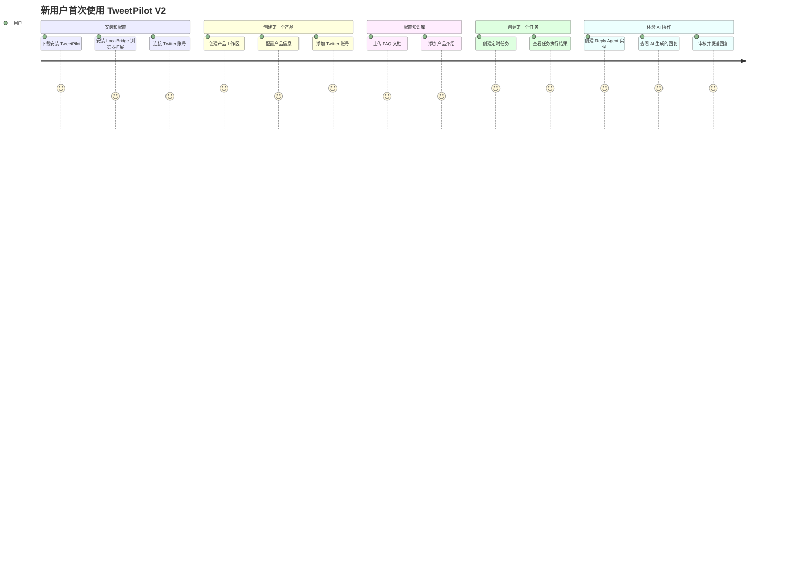
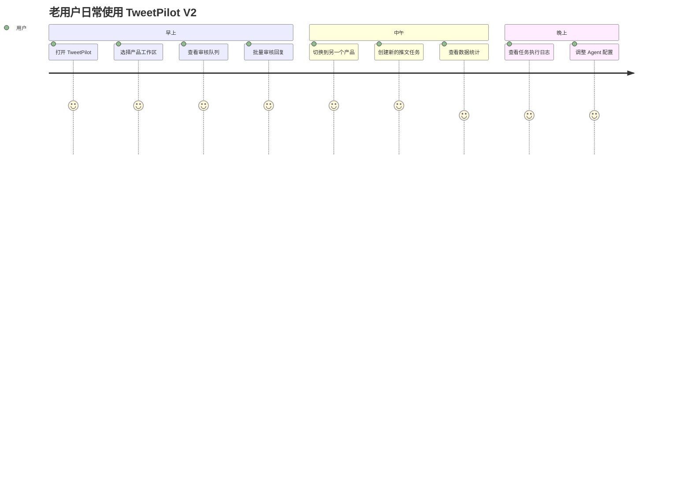

# TweetPilot V2 产品需求总纲

## 文档信息
- 版本：v2.0.0
- 创建日期：2026-04-12
- 文档状态：初稿
- 负责人：产品团队

## 1. 产品定位

### 1.1 一句话定义

**TweetPilot 是一个模块化的 Twitter 运营自动化平台，通过产品中心化的工作区模式和 AI Agent 协作，让企业和个人开发者能够高效管理多个 Twitter 产品的运营工作。**

### 1.2 核心价值主张

**为谁**：
- 一人公司和独立开发者（主要用户）
- Web3/AI/SaaS 创业团队
- Twitter 代运营公司
- 大企业的社媒运营团队

**解决什么问题**：
- Twitter 运营工作重复繁琐，占用大量时间
- 多个产品的运营数据和知识混乱，难以管理
- 缺少专业的运营团队，但又需要保持 Twitter 活跃度
- 现有工具要么功能简单，要么过于复杂难以上手

**提供什么价值**：
- **产品中心化**：类似 IDE 的工作区体验，每个产品独立管理
- **模块化架构**：功能模块独立，可以按需使用，逐步扩展
- **AI 协作**：集成 Claurst Agent 能力，自动化处理重复性工作
- **本地优先**：数据存储在本地，隐私安全可控
- **开发者友好**：开源、可扩展、可定制

### 1.3 与竞品的差异化

| 维度 | TweetPilot V2 | Buffer/Hootsuite | Typefully | 自建脚本 |
|------|--------------|------------------|-----------|---------|
| **产品中心化** | ✅ 类似 IDE 工作区 | ❌ 账号中心化 | ❌ 账号中心化 | ❌ 无组织 |
| **模块化架构** | ✅ 功能模块独立 | ❌ 一体化 | ❌ 一体化 | ✅ 自己组合 |
| **AI 协作** | ✅ Claurst Agent | ❌ 无 | ⚠️ 简单 AI | ❌ 无 |
| **本地优先** | ✅ 数据本地存储 | ❌ 云端 | ❌ 云端 | ✅ 本地 |
| **开发者友好** | ✅ 开源可扩展 | ❌ 闭源 | ❌ 闭源 | ✅ 完全自由 |
| **上手难度** | ⚠️ 中等 | ✅ 简单 | ✅ 简单 | ❌ 困难 |
| **成本** | ✅ 开源免费 | ❌ 订阅制 | ❌ 订阅制 | ✅ 免费 |

**核心差异化**：
1. **产品中心化的工作区模式**：首创类似 VS Code 的产品工作区体验
2. **模块化架构**：功能模块完全独立，可以按需使用，不强制使用全部功能
3. **Claurst Agent 集成**：利用 Claurst 的 Managed Agents 和 Multi-Provider 能力
4. **本地优先 + 开源**：数据隐私可控，代码完全开源，可自由定制


## 2. 产品功能全景

### 2.1 功能模块清单

TweetPilot V2 采用**接口优先、模块并行开发**的模块化架构。每个模块独立开发，通过定义良好的接口与其他模块交互。

| 模块名称 | 功能描述 | 优先级 | 接口依赖 |
|---------|---------|--------|---------|
| **LocalBridge HTTP Client 模块** | 封装 LocalBridge REST API 调用，提供类型安全接口 | P0 | 无（调用 LocalBridge REST API） |
| **数据存储模块** | 存储推文、评论、用户等数据到本地数据库 | P0 | ILocalBridgeClient |
| **任务管理模块** | 管理即时任务和定时任务 | P0 | ILocalBridgeClient, IDataStorage |
| **产品管理模块** | 管理多个产品，产品中心化工作区 | P0 | IDataStorage |
| **知识库模块** | 管理产品专属知识库（FAQ、产品资料） | P1 | IProductManagement |
| **Claurst 驱动模块** | 驱动 Claurst 进程，管理 Agent 任务执行 | P1 | IProductManagement, IKnowledgeBase, ITaskManagement |
| **MCP 服务器模块** | 提供 Twitter、知识库、数据访问的 MCP 接口 | P1 | ILocalBridgeClient, IKnowledgeBase, IDataStorage |
| **沙箱模块** | 运行自定义代码，扩展功能 | P2 | IClaurstDriver |
| **UI 模块** | 提供用户界面，产品选择器、工作台等 | P0 | 所有模块接口 |

**优先级说明**：
- **P0**：第一阶段必须完成，核心功能
- **P1**：第二阶段完成，重要功能
- **P2**：第三阶段完成，高级功能

**接口依赖说明**：
- 模块之间通过接口（Interface）进行交互，而非直接依赖具体实现
- 接口依赖表示该模块需要调用其他模块的接口，但不关心具体实现
- 开发时可以使用 Mock 实现，真实实现完成后再替换

**重要说明：Claurst Host Manager（借鉴 VS Code Extension Host 架构）**：

我们**不开发独立的 Agent 引擎**，而是**管理 Claurst Host 进程**（类似 VS Code 管理 Extension Host）。

```
❌ 错误理解：开发独立的 Agent 能力模块
- 实现 Agent 编排逻辑
- 实现 Worker 管理
- 实现任务分解算法
- 实现 Coordinator-Worker 模式

✅ 正确理解：开发 Claurst Host Manager（Extension Host 模式）
- 启动单一 Claurst Host 进程（Coordinator Mode）
- 通过 IPC（stdin/stdout + JSON）与 Claurst Host 通信
- 构建 JSON 消息，发送任务到 Claurst Host
- 解析 JSON 响应，提取任务结果
- 管理 Claurst Host 进程生命周期（启动、重启、关闭）
- 监控 Claurst Host 进程健康状态（定期 ping）
- 自动重启崩溃的 Claurst Host 进程
```

**VS Code Extension Host 架构对比**：

| 维度 | VS Code | TweetPilot |
|------|---------|-----------|
| **主进程** | VS Code Main Process | TweetPilot 主进程 |
| **Host 进程** | Extension Host | Claurst Host (Coordinator) |
| **通信方式** | IPC (stdin/stdout + JSON) | IPC (stdin/stdout + JSON) |
| **Worker/Extension** | Extensions | Worker Agents |
| **共享资源** | VS Code API | MCP Servers |
| **进程隔离** | Extension 崩溃不影响主进程 | Worker 崩溃不影响 TweetPilot |

**Claurst Host Manager 的职责**：
- **进程管理**：启动、停止、重启 Claurst Host 进程
- **IPC 通信**：通过 stdin/stdout + JSON 进行可靠的进程间通信
- **消息编码/解码**：构建和解析 JSON 消息
- **任务提交**：将 TweetPilot 的任务转换为 JSON 消息，通过 stdin 发送
- **结果解析**：从 stdout 接收 JSON 响应，提取任务结果
- **健康监控**：定期 ping Claurst Host，检查进程健康状态
- **自动重启**：检测到进程崩溃时自动重启
- **错误处理**：处理超时、通信失败等异常情况

**Agent 的核心能力由 Claurst Host 提供**：
- Coordinator-Worker 模式（Claurst Host 内部管理所有 Worker）
- 任务分解和编排（Coordinator 自动分解任务）
- 多模型支持（Coordinator 用 Opus，Worker 用 Haiku/Sonnet）
- MCP 工具调用（所有 Worker 共享 MCP Servers）
- 会话管理和经验积累（每个 Worker 有独立会话）

**核心优势**：
- ✅ **单一 Host 进程**：一个 Claurst Host 管理所有 Worker，简化架构
- ✅ **IPC 通信**：stdin/stdout + JSON，可靠、跨平台、易于调试
- ✅ **进程隔离**：Worker 崩溃不影响 TweetPilot 主进程
- ✅ **自动重启**：Host 进程崩溃时自动重启，保证可用性
- ✅ **资源共享**：所有 Worker 共享 MCP Servers，避免重复配置

我们只是 Claurst Host 的**管理者和调用者**，不是 Agent 引擎的**开发者**。

### 2.1.1 接口优先 + UI 优先开发策略

**核心理念**：
- **接口先行**：第一步定义所有模块的对外接口（TypeScript Interface）
- **UI 先行**：第一步完成所有核心界面的设计和实现
- **Mock 实现**：为每个接口创建 Mock 实现，返回符合接口规范的假数据
- **UI 驱动开发**：UI 作为产品形态的定义，指导后端开发
- **并行开发**：各模块基于接口和 UI 独立开发，不依赖其他模块的真实实现
- **渐进替换**：模块完成后，用真实实现替换 Mock 实现

**为什么 UI 优先？**

1. **尽早确定产品形态**
   - UI 是产品的最终呈现形式
   - 通过 UI 可以直观地看到产品的功能和交互
   - 避免后期发现 UI 不符合预期而大规模返工

2. **UI 作为"规格说明书"**
   - UI 定义了所有功能的输入和输出
   - UI 定义了所有交互流程
   - 后端开发只需要满足 UI 的需求即可

3. **防止 AI 开发思路漂移**
   - AI 在开发过程中容易偏离原始需求
   - 完整的 UI 作为严格的约束，防止思路漂移
   - 每个功能都有明确的 UI 对应，不会过度设计

4. **尽早进行用户测试**
   - UI 完成后可以立即进行用户测试（使用 Mock 数据）
   - 收集用户反馈，调整产品方向
   - 避免后端开发完成后才发现 UI 不符合用户需求

**开发流程**：

```
阶段 0: 接口设计 + UI 设计（并行，2-3 周）
├── 接口设计（1 周）
│   ├── 定义所有模块的 TypeScript 接口
│   ├── 定义数据模型（DTO/Entity）
│   ├── 创建 Mock 实现（返回假数据）
│   └── 编写接口文档
│
└── UI 设计和实现（2-3 周，可与接口设计并行）
    ├── 使用 UI/UX 设计工具（Figma、Sketch）设计原型
    ├── 实现完整的 UI（React + TypeScript）
    │   ├── 产品选择器
    │   ├── 产品工作台
    │   ├── 任务管理界面
    │   ├── 审核队列
    │   ├── 角色实例管理
    │   ├── 知识库管理
    │   └── 数据统计和报表
    ├── UI 连接 Mock 接口（所有数据都是假的）
    └── UI 可以完整演示所有功能流程

阶段 1: 后端模块并行开发（4-6 周）
├── UI 已完成，作为开发规格
├── 所有模块使用 Mock 接口独立开发
├── LocalBridge 驱动模块
├── 数据存储模块
├── 任务管理模块
├── 产品管理模块
├── 知识库模块
├── Claurst 驱动模块
└── MCP 服务器模块

阶段 2: 集成测试（2-3 周）
└── 逐步用真实实现替换 Mock，进行集成测试
```

**UI 优先的具体实施**：

**使用 ui-ux-pro-max-skill 进行 UI/UX 设计**：

TweetPilot V2 的 UI/UX 设计将使用 [ui-ux-pro-max-skill](https://github.com/nextlevelbuilder/ui-ux-pro-max-skill) 进行专业设计和实现。

**ui-ux-pro-max-skill 的优势**：
- ✅ **专业的 UI/UX 设计流程**：从用户研究到原型设计到实现的完整流程
- ✅ **设计系统支持**：内置设计系统和组件库
- ✅ **响应式设计**：自动适配桌面端、平板端、移动端
- ✅ **无障碍设计**：符合 WCAG 标准的无障碍设计
- ✅ **快速原型**：快速生成可交互的原型
- ✅ **设计规范**：自动生成设计规范文档

**UI 设计流程**（使用 ui-ux-pro-max-skill）：

1. **用户研究和需求分析**
   - 定义目标用户（一人公司、独立开发者、创业团队）
   - 分析用户场景和痛点
   - 确定核心功能和优先级

2. **信息架构设计**
   - 产品选择器（类似 VS Code Workspace Selector）
   - 产品工作台（类似 VS Code Workbench）
   - 任务管理界面
   - 审核队列界面
   - 角色实例管理界面
   - 知识库管理界面
   - 数据统计和报表界面

3. **交互设计和原型**
   - 使用 ui-ux-pro-max-skill 生成交互原型
   - 用户测试和反馈收集
   - 迭代优化

4. **视觉设计**
   - 设计系统（色彩、字体、图标、间距）
   - UI 组件库
   - 响应式布局

5. **UI 实现**
   - React + TypeScript
   - Tailwind CSS（样式）
   - Vite（构建工具）
   - React Router（路由）
   - 使用 ui-ux-pro-max-skill 生成的组件库

**设计原则**（参考 VS Code）：
- **产品中心化**：产品选择器作为入口，类似 VS Code 的 Workspace
- **简洁高效**：界面简洁，操作高效，减少点击次数
- **一致性**：界面风格一致，交互模式一致
- **专业可靠**：类似 IDE 的专业体验

**详细的 UI/UX 设计文档**：
- 完整的 UI/UX 设计将在 [05-UI-UX设计规范.md](docs/v2/05-UI-UX设计规范.md) 中详细说明
- 使用 ui-ux-pro-max-skill 生成的设计规范和组件库

4. **UI 与 Mock 接口集成**
   ```typescript
   // UI 组件使用依赖注入，不关心接口是 Mock 还是真实实现
   
   // 开发阶段：使用 Mock
   const container = setupContainer(true); // useMock = true
   const productService = container.get<IProductManagement>('IProductManagement');
   
   // 生产阶段：使用真实实现
   const container = setupContainer(false); // useMock = false
   const productService = container.get<IProductManagement>('IProductManagement');
   ```

**UI 作为严格约束的示例**：

```typescript
// UI 定义了产品选择器的交互流程
// 后端开发必须严格按照这个流程实现

// 1. UI 显示产品列表
const products = await productService.getProducts();

// 2. 用户选择产品
const selectedProduct = products[0];

// 3. UI 加载产品配置
const config = await productService.getProductConfig(selectedProduct.id);

// 4. UI 显示产品工作台
// ... 后续流程

// 后端开发只需要实现这些接口，不能偏离 UI 定义的流程
```

**优势总结**：
- ✅ **产品形态确定**：UI 完成后，产品形态就确定了
- ✅ **开发目标明确**：后端开发只需要满足 UI 的需求
- ✅ **防止过度设计**：UI 没有的功能，后端不需要实现
- ✅ **防止思路漂移**：UI 作为严格约束，AI 不会偏离需求
- ✅ **尽早用户测试**：UI 完成后可以立即进行用户测试
- ✅ **并行开发**：UI 和后端可以并行开发（UI 使用 Mock 接口）

**接口示例**：

```typescript
// ILocalBridge 接口定义
interface ILocalBridge {
  getTweet(tweetId: string): Promise<Tweet>;
  sendTweet(content: string, accountId: string): Promise<Tweet>;
  getComments(tweetId: string): Promise<Comment[]>;
  replyToComment(commentId: string, content: string): Promise<Comment>;
}

// Mock 实现（用于开发阶段）
class MockLocalBridge implements ILocalBridge {
  async getTweet(tweetId: string): Promise<Tweet> {
    return {
      id: tweetId,
      content: 'Mock tweet content',
      author: 'mock_user',
      createdAt: new Date(),
    };
  }
  
  async sendTweet(content: string, accountId: string): Promise<Tweet> {
    return {
      id: 'mock_tweet_id',
      content,
      author: accountId,
      createdAt: new Date(),
    };
  }
  
  // ... 其他方法的 Mock 实现
}

// 真实实现（完成后替换 Mock）
class LocalBridge implements ILocalBridge {
  // 真实的浏览器扩展驱动实现
}
```

### 2.2 模块之间的接口关系



```mermaid
graph TD
    UI[UI 模块] -->|调用| IProductManagement[IProductManagement 接口]
    UI -->|调用| ITaskManagement[ITaskManagement 接口]
    UI -->|调用| IKnowledgeBase[IKnowledgeBase 接口]
    UI -->|调用| IAgentCapability[IAgentCapability 接口]
    
    PM[产品管理模块] -.实现.-> IProductManagement
    TM[任务管理模块] -.实现.-> ITaskManagement
    KB[知识库模块] -.实现.-> IKnowledgeBase
    AG[Agent 能力模块] -.实现.-> IAgentCapability
    
    PM -->|调用| IDataStorage[IDataStorage 接口]
    TM -->|调用| IDataStorage
    TM -->|调用| ILocalBridge[ILocalBridge 接口]
    KB -->|调用| IProductManagement
    AG -->|调用| IProductManagement
    AG -->|调用| IKnowledgeBase
    AG -->|调用| ITaskManagement
    
    DS[数据存储模块] -.实现.-> IDataStorage
    LB[LocalBridge 驱动模块] -.实现.-> ILocalBridge
    
    SB[沙箱模块] -->|调用| IAgentCapability
    
    style UI fill:#e1f5ff
    style PM fill:#fff4e1
    style TM fill:#fff4e1
    style KB fill:#fff4e1
    style AG fill:#e8f5e9
    style SB fill:#f3e5f5
    style DS fill:#ffebee
    style LB fill:#ffebee
    style IProductManagement fill:#d4edda
    style ITaskManagement fill:#d4edda
    style IKnowledgeBase fill:#d4edda
    style IAgentCapability fill:#d4edda
    style IDataStorage fill:#d4edda
    style ILocalBridge fill:#d4edda
```

**关系说明**：
- **实线箭头**：表示模块调用接口（接口依赖）
- **虚线箭头**：表示模块实现接口（实现关系）
- **绿色节点**：表示接口定义
- **彩色节点**：表示具体模块实现

**核心原则**：
- 模块之间**只通过接口交互**，不直接依赖具体实现
- 每个模块可以独立开发，使用 Mock 接口进行测试
- 接口定义在 `src/interfaces/` 目录，所有模块共享
- Mock 实现在 `src/mocks/` 目录，用于开发和测试

### 2.3 功能优先级矩阵（接口优先 + UI 优先开发）

| 功能 | 用户价值 | 技术复杂度 | 优先级 | 迭代 | 开发方式 |
|------|---------|-----------|--------|------|---------|
| **接口设计（所有模块）** | 高 | 中 | P0 | 迭代 0 | 串行（1 周） |
| **UI 设计和实现（所有界面）** | 高 | 中 | P0 | 迭代 0 | 并行（2-3 周，可与接口设计并行） |
| LocalBridge 驱动 | 高 | 中 | P0 | 迭代 1 | 并行（UI 已完成，使用 Mock） |
| 本地数据存储 | 高 | 低 | P0 | 迭代 1 | 并行（UI 已完成，使用 Mock） |
| 任务管理（即时） | 高 | 中 | P0 | 迭代 1 | 并行（UI 已完成，使用 Mock） |
| 任务管理（定时） | 高 | 中 | P0 | 迭代 1 | 并行（UI 已完成，使用 Mock） |
| 产品管理 | 高 | 中 | P0 | 迭代 1 | 并行（UI 已完成，使用 Mock） |
| 本地知识库 | 中 | 中 | P1 | 迭代 2 | 并行（UI 已完成，使用 Mock） |
| Claurst 驱动模块 | 高 | 高 | P1 | 迭代 2 | 并行（UI 已完成，使用 Mock） |
| MCP 服务器模块 | 高 | 高 | P1 | 迭代 2 | 并行（UI 已完成，使用 Mock） |
| 本地沙箱 | 低 | 高 | P2 | 迭代 3 | 并行（UI 已完成，使用 Mock） |
| **集成测试** | 高 | 中 | P0 | 迭代 4 | 串行（替换 Mock 为真实实现） |

**迭代说明**：

**迭代 0：接口设计 + UI 设计（2-3 周，部分并行）**

**第 1 周：接口设计（串行）**
- 定义所有模块的 TypeScript 接口
- 定义数据模型（DTO/Entity/Types）
- 创建 Mock 实现（返回假数据）
- 编写接口文档和使用示例
- **交付物**：完整的接口定义 + Mock 实现 + 接口文档

**第 2-3 周：UI 设计和实现（可与接口设计并行开始）**
- 使用 UI/UX 设计工具设计原型（Figma/Sketch/v0.dev）
- 实现完整的 UI（React + TypeScript + Tailwind CSS）
  - 产品选择器界面
  - 产品工作台界面
  - 任务管理界面（任务列表、任务详情、任务执行状态）
  - 审核队列界面（待审核列表、审核详情、审核操作）
  - 角色实例管理界面（角色列表、角色配置、角色状态）
  - 知识库管理界面（知识库列表、知识库编辑）
  - 数据统计和报表界面
- UI 连接 Mock 接口（所有数据都是假的）
- UI 可以完整演示所有功能流程
- **交付物**：完整可用的 UI + Mock 数据演示

**关键点**：
- UI 完成后，产品形态就确定了
- UI 作为"规格说明书"，指导后续所有后端开发
- 后端开发只需要满足 UI 定义的接口和交互流程

**迭代 1：核心功能并行开发（4-6 周，并行）**
- **前提**：UI 已完成，所有界面都可以用 Mock 数据演示
- 所有 P0 模块同时开发
- 每个模块使用 Mock 接口进行开发和测试
- 开发过程中严格按照 UI 定义的交互流程实现
- 不需要等待其他模块完成
- **交付物**：所有 P0 模块的真实实现

**迭代 2：扩展功能并行开发（3-4 周，并行）**
- **前提**：UI 已完成，核心功能已实现
- 所有 P1 模块同时开发
- 继续使用 Mock 接口
- **交付物**：所有 P1 模块的真实实现

**迭代 3：高级功能开发（2-3 周）**
- P2 模块开发
- **交付物**：所有 P2 模块的真实实现

**迭代 4：集成测试（2-3 周，串行）**
- 逐步用真实实现替换 Mock
- 进行端到端集成测试
- 修复集成问题
- **交付物**：完整可用的系统

**时间优势**：
- 传统串行开发：约 16-20 周（迭代 1-7）
- 接口优先 + UI 优先并行开发：约 10-12 周（迭代 0: 3 周 + 迭代 1: 6 周 + 迭代 4: 3 周）
- **节省时间：40-50%**

**UI 优先的额外优势**：
- ✅ 第 3 周就可以向用户展示完整的产品形态（使用 Mock 数据）
- ✅ 可以尽早收集用户反馈，调整产品方向
- ✅ 后端开发有明确的目标和约束，不会过度设计
- ✅ 防止 AI 开发思路漂移，UI 作为严格的规格说明书

## 3. 用户场景

### 3.0 接口设计规范和 Mock 实现策略

在开始用户场景描述之前,我们需要明确接口设计规范和 Mock 实现策略,这是**接口优先开发**的基础。

#### 3.0.1 接口设计规范

**接口命名规范**：
- 接口名称以 `I` 开头,例如：`ILocalBridge`、`IDataStorage`
- 接口文件放在 `src/interfaces/` 目录
- 每个接口一个文件,文件名与接口名对应（去掉 `I` 前缀）

**接口定义示例**：

```typescript
// src/interfaces/ILocalBridge.ts
export interface ILocalBridge {
  // 获取推文
  getTweet(tweetId: string): Promise<Tweet>;
  
  // 发送推文
  sendTweet(content: string, accountId: string): Promise<Tweet>;
  
  // 获取评论列表
  getComments(tweetId: string): Promise<Comment[]>;
  
  // 回复评论
  replyToComment(commentId: string, content: string, accountId: string): Promise<Comment>;
}

// src/interfaces/IDataStorage.ts
export interface IDataStorage {
  // 保存推文
  saveTweet(tweet: Tweet): Promise<void>;
  
  // 查询推文
  getTweet(tweetId: string): Promise<Tweet | null>;
  
  // 查询推文列表
  getTweets(filter: TweetFilter): Promise<Tweet[]>;
  
  // 保存评论
  saveComment(comment: Comment): Promise<void>;
  
  // 查询评论列表
  getComments(tweetId: string): Promise<Comment[]>;
}

// src/interfaces/ITaskManagement.ts
export interface ITaskManagement {
  // 创建任务
  createTask(task: CreateTaskDTO): Promise<Task>;
  
  // 执行任务
  executeTask(taskId: string): Promise<TaskResult>;
  
  // 获取任务状态
  getTaskStatus(taskId: string): Promise<TaskStatus>;
  
  // 取消任务
  cancelTask(taskId: string): Promise<void>;
}
```

**数据模型定义**：

```typescript
// src/types/Tweet.ts
export interface Tweet {
  id: string;
  content: string;
  author: string;
  createdAt: Date;
  likes: number;
  retweets: number;
  replies: number;
}

// src/types/Comment.ts
export interface Comment {
  id: string;
  tweetId: string;
  content: string;
  author: string;
  createdAt: Date;
}

// src/types/Task.ts
export interface Task {
  id: string;
  type: TaskType;
  status: TaskStatus;
  productId: string;
  workspaceId: string;
  createdAt: Date;
  updatedAt: Date;
}

export enum TaskType {
  REPLY_COMMENT = 'reply_comment',
  CREATE_TWEET = 'create_tweet',
  ANALYZE_DATA = 'analyze_data',
}

export enum TaskStatus {
  PENDING = 'pending',
  IN_PROGRESS = 'in_progress',
  COMPLETED = 'completed',
  FAILED = 'failed',
}
```

#### 3.0.2 Mock 实现策略

**Mock 实现规范**：
- Mock 类名以 `Mock` 开头,例如：`MockLocalBridge`、`MockDataStorage`
- Mock 实现放在 `src/mocks/` 目录
- Mock 实现必须完全符合接口定义
- Mock 返回的数据必须符合数据模型定义

**Mock 实现示例**：

```typescript
// src/mocks/MockLocalBridge.ts
import { ILocalBridge } from '../interfaces/ILocalBridge';
import { Tweet, Comment } from '../types';

export class MockLocalBridge implements ILocalBridge {
  private mockTweets: Map<string, Tweet> = new Map();
  private mockComments: Map<string, Comment> = new Map();

  async getTweet(tweetId: string): Promise<Tweet> {
    // 返回 Mock 数据
    return {
      id: tweetId,
      content: `Mock tweet content for ${tweetId}`,
      author: 'mock_user',
      createdAt: new Date(),
      likes: 10,
      retweets: 5,
      replies: 3,
    };
  }

  async sendTweet(content: string, accountId: string): Promise<Tweet> {
    const tweet: Tweet = {
      id: `mock_tweet_${Date.now()}`,
      content,
      author: accountId,
      createdAt: new Date(),
      likes: 0,
      retweets: 0,
      replies: 0,
    };
    
    this.mockTweets.set(tweet.id, tweet);
    return tweet;
  }

  async getComments(tweetId: string): Promise<Comment[]> {
    // 返回 Mock 评论列表
    return [
      {
        id: `mock_comment_1`,
        tweetId,
        content: 'Mock comment 1',
        author: 'user1',
        createdAt: new Date(),
      },
      {
        id: `mock_comment_2`,
        tweetId,
        content: 'Mock comment 2',
        author: 'user2',
        createdAt: new Date(),
      },
    ];
  }

  async replyToComment(
    commentId: string,
    content: string,
    accountId: string
  ): Promise<Comment> {
    const comment: Comment = {
      id: `mock_reply_${Date.now()}`,
      tweetId: 'mock_tweet_id',
      content,
      author: accountId,
      createdAt: new Date(),
    };
    
    this.mockComments.set(comment.id, comment);
    return comment;
  }
}

// src/mocks/MockDataStorage.ts
import { IDataStorage } from '../interfaces/IDataStorage';
import { Tweet, Comment, TweetFilter } from '../types';

export class MockDataStorage implements IDataStorage {
  private tweets: Map<string, Tweet> = new Map();
  private comments: Map<string, Comment[]> = new Map();

  async saveTweet(tweet: Tweet): Promise<void> {
    this.tweets.set(tweet.id, tweet);
    console.log(`[MockDataStorage] Saved tweet: ${tweet.id}`);
  }

  async getTweet(tweetId: string): Promise<Tweet | null> {
    return this.tweets.get(tweetId) || null;
  }

  async getTweets(filter: TweetFilter): Promise<Tweet[]> {
    // 返回所有 Mock 推文
    return Array.from(this.tweets.values());
  }

  async saveComment(comment: Comment): Promise<void> {
    const tweetComments = this.comments.get(comment.tweetId) || [];
    tweetComments.push(comment);
    this.comments.set(comment.tweetId, tweetComments);
    console.log(`[MockDataStorage] Saved comment: ${comment.id}`);
  }

  async getComments(tweetId: string): Promise<Comment[]> {
    return this.comments.get(tweetId) || [];
  }
}
```

#### 3.0.3 依赖注入和模块组装

**依赖注入容器**：

```typescript
// src/di/Container.ts
export class Container {
  private services: Map<string, any> = new Map();

  // 注册服务
  register<T>(name: string, service: T): void {
    this.services.set(name, service);
  }

  // 获取服务
  get<T>(name: string): T {
    const service = this.services.get(name);
    if (!service) {
      throw new Error(`Service ${name} not found`);
    }
    return service;
  }
}

// src/di/setup.ts
import { Container } from './Container';
import { ILocalBridge } from '../interfaces/ILocalBridge';
import { IDataStorage } from '../interfaces/IDataStorage';
import { MockLocalBridge } from '../mocks/MockLocalBridge';
import { MockDataStorage } from '../mocks/MockDataStorage';
// import { LocalBridge } from '../modules/LocalBridge'; // 真实实现
// import { DataStorage } from '../modules/DataStorage'; // 真实实现

export function setupContainer(useMock: boolean = true): Container {
  const container = new Container();

  if (useMock) {
    // 使用 Mock 实现（开发阶段）
    container.register<ILocalBridge>('ILocalBridge', new MockLocalBridge());
    container.register<IDataStorage>('IDataStorage', new MockDataStorage());
  } else {
    // 使用真实实现（集成测试和生产环境）
    // container.register<ILocalBridge>('ILocalBridge', new LocalBridge());
    // container.register<IDataStorage>('IDataStorage', new DataStorage());
  }

  return container;
}
```

**模块使用示例**：

```typescript
// src/modules/TaskManagement.ts
import { ILocalBridge } from '../interfaces/ILocalBridge';
import { IDataStorage } from '../interfaces/IDataStorage';
import { Task, TaskResult } from '../types';

export class TaskManagement {
  constructor(
    private localBridge: ILocalBridge,
    private dataStorage: IDataStorage
  ) {}

  async executeReplyTask(task: Task): Promise<TaskResult> {
    // 1. 获取评论（通过 ILocalBridge 接口）
    const comments = await this.localBridge.getComments(task.targetId);
    
    // 2. 生成回复内容（这里简化处理）
    const replyContent = `Thank you for your comment!`;
    
    // 3. 发送回复（通过 ILocalBridge 接口）
    const reply = await this.localBridge.replyToComment(
      comments[0].id,
      replyContent,
      task.accountId
    );
    
    // 4. 保存到数据库（通过 IDataStorage 接口）
    await this.dataStorage.saveComment(reply);
    
    return {
      success: true,
      result: reply,
    };
  }
}

// 使用示例
const container = setupContainer(true); // 使用 Mock
const localBridge = container.get<ILocalBridge>('ILocalBridge');
const dataStorage = container.get<IDataStorage>('IDataStorage');
const taskManagement = new TaskManagement(localBridge, dataStorage);

// 执行任务（不关心 localBridge 和 dataStorage 是 Mock 还是真实实现）
await taskManagement.executeReplyTask(task);
```

#### 3.0.4 从 Mock 到真实实现的切换

**切换策略**：
1. **开发阶段**：所有模块使用 Mock 实现
2. **模块完成**：将该模块的 Mock 替换为真实实现
3. **集成测试**：逐步替换所有 Mock 为真实实现
4. **生产环境**：全部使用真实实现

**切换示例**：

```typescript
// 开发阶段：使用 Mock
const container = setupContainer(true);

// 集成测试：部分使用真实实现
const container = new Container();
container.register<ILocalBridge>('ILocalBridge', new LocalBridge()); // 真实实现
container.register<IDataStorage>('IDataStorage', new MockDataStorage()); // 仍使用 Mock

// 生产环境：全部使用真实实现
const container = setupContainer(false);
```

**优势**：
- ✅ 模块开发完全独立，不需要等待其他模块
- ✅ 切换 Mock 和真实实现只需要修改依赖注入配置
- ✅ 测试友好，可以轻松 Mock 依赖
- ✅ 接口稳定，实现可以随时替换

---

### 3.1 核心用户场景

#### 场景 1：一人公司管理单个产品的 Twitter 运营

**用户**：Alex，独立开发者，开发了一个 SaaS 产品

**痛点**：
- 每天花 1-2 小时在 Twitter 上回复评论、发推文
- 想保持 Twitter 活跃度，但没有时间和精力
- 担心回复不及时，影响用户体验

**使用 TweetPilot V2**：
1. 打开 TweetPilot，选择产品"我的 SaaS"
2. 配置产品知识库（FAQ、产品介绍）
3. 创建 Reply Agent 角色实例，配置为 Claude Sonnet
4. 设置定时任务：每小时检查新评论，自动生成回复草稿
5. 每天早上查看审核队列，批量审核和发送回复
6. 节省 80% 的时间，从 1-2 小时降低到 15-20 分钟

**价值**：
- ✅ 节省时间，专注于产品开发
- ✅ 保持 Twitter 活跃度
- ✅ 回复质量一致，符合品牌语气

---

#### 场景 2：创业团队管理多个产品的 Twitter 账号

**用户**：Sarah，Web3 创业公司的运营负责人，管理 3 个产品

**痛点**：
- 3 个产品的 Twitter 账号，数据和知识混乱
- 不同产品的回复风格不一致
- 团队成员不知道哪个账号该回复什么

**使用 TweetPilot V2**：
1. 创建 3 个产品工作区：产品 A、产品 B、产品 C
2. 每个产品配置独立的知识库和 Twitter 账号
3. 为每个产品创建专属的 Reply Agent 实例
4. 切换产品工作区，就像切换 VS Code 工作区一样简单
5. 每个产品的数据和知识完全隔离，不会混乱

**价值**：
- ✅ 产品数据和知识隔离，清晰有序
- ✅ 不同产品的回复风格一致
- ✅ 团队协作更高效

---

#### 场景 3：代运营公司管理多个客户的 Twitter 账号

**用户**：Mike，Twitter 代运营公司的项目经理，管理 10+ 客户

**痛点**：
- 客户太多，每个客户有多个产品
- 客户的知识库和品牌语气都不同
- 需要生成报表，向客户交付

**使用 TweetPilot V2**：
1. 为每个客户的每个产品创建独立的工作区
2. 配置客户专属的知识库和品牌语气
3. 创建不同的 Agent 实例，使用不同的模型（成本优化）
4. 定时生成报表，导出给客户
5. 团队成员可以协作，分配任务

**价值**：
- ✅ 客户数据完全隔离，安全可靠
- ✅ 可以为不同客户配置不同的 AI 模型（成本优化）
- ✅ 报表和交付更专业

---

#### 场景 4：开发者扩展自定义功能

**用户**：David，技术极客，想要自定义一些特殊功能

**痛点**：
- 现有工具功能固定，无法扩展
- 想要实现一些特殊的自动化逻辑
- 不想从零开发，但又需要定制

**使用 TweetPilot V2**：
1. 使用 TweetPilot 的核心模块（LocalBridge、数据存储、任务管理）
2. 在沙箱模块中编写自定义代码
3. 调用 TweetPilot 的 API，实现自定义逻辑
4. 例如：自动分析推文情感，自动生成周报，自动识别潜在客户

**价值**：
- ✅ 开源可扩展，完全自由
- ✅ 模块化架构，可以只使用需要的部分
- ✅ 开发者友好，有完整的 API 文档

---

### 3.2 用户旅程地图

#### 新用户首次使用



**关键时刻**：
1. **Aha 时刻 1**：创建产品工作区，体验产品中心化
2. **Aha 时刻 2**：第一个任务执行成功，看到自动化的价值
3. **Aha 时刻 3**：AI 生成的回复质量很高，节省大量时间

---

#### 老用户日常使用



**关键时刻**：
1. **高效切换**：在多个产品之间快速切换
2. **批量操作**：批量审核和发送回复
3. **数据洞察**：查看数据统计，了解运营效果

## 4. 产品边界

### 4.1 做什么（In Scope）

**核心功能**：
- ✅ 产品中心化的工作区管理
- ✅ LocalBridge 驱动，执行 Twitter 操作
- ✅ 本地数据存储，推文、评论、用户信息
- ✅ 任务管理，即时任务和定时任务
- ✅ 产品专属知识库
- ✅ Claurst Agent 集成，AI 协作
- ✅ 角色实例管理，多模型支持
- ✅ 审核队列，人工审核 AI 生成的内容
- ✅ 基础数据统计和报表

**技术特性**：
- ✅ 模块化架构，功能模块独立
- ✅ 本地优先，数据存储在本地
- ✅ 开源，代码完全开放
- ✅ 可扩展，支持自定义功能
- ✅ 跨平台，支持 macOS、Windows、Linux

### 4.2 不做什么（Out of Scope）

**不做的功能**：
- ❌ 云端服务，不提供 SaaS 版本（至少第一阶段不做）
- ❌ 移动端 App，只做桌面端
- ❌ 社交媒体分析，不做复杂的数据分析和可视化
- ❌ 多平台支持，只支持 Twitter/X（不支持 Facebook、Instagram 等）
- ❌ 团队协作功能，不做复杂的权限管理和审批流程（第一阶段）
- ❌ 付费功能，不做商业化（第一阶段）

**不做的原因**：
1. **聚焦核心价值**：产品中心化 + 模块化 + AI 协作
2. **降低复杂度**：避免功能过多，难以维护
3. **快速迭代**：先做好核心功能，再考虑扩展

### 4.3 未来可能做什么（Future Scope）

**第二阶段（6-12 个月）**：
- 🔮 云端同步，支持多设备同步
- 🔮 团队协作，支持多人协作和权限管理
- 🔮 高级数据分析，支持更复杂的数据可视化
- 🔮 插件市场，支持第三方插件

**第三阶段（12-24 个月）**：
- 🔮 多平台支持，支持 Facebook、Instagram、LinkedIn
- 🔮 移动端 App，支持 iOS 和 Android
- 🔮 商业化，提供付费功能和企业版

## 5. 成功指标

### 5.1 产品成功的定义

**短期目标（3 个月）**：
- 完成核心功能开发（迭代 1-4）
- 10 个早期用户使用并提供反馈
- 核心功能稳定，无重大 Bug

**中期目标（6 个月）**：
- 完成所有 P0 和 P1 功能（迭代 1-6）
- 100 个活跃用户
- 用户平均每周使用 3 次以上
- 用户反馈 NPS > 40

**长期目标（12 个月）**：
- 1000 个活跃用户
- 社区活跃，有贡献者提交 PR
- 形成产品口碑，用户自发推荐

### 5.2 关键指标（KPI）

**用户增长指标**：
- 注册用户数
- 活跃用户数（DAU/WAU/MAU）
- 用户留存率（次日留存、7 日留存、30 日留存）

**用户参与指标**：
- 平均每周使用次数
- 平均每次使用时长
- 创建的产品工作区数量
- 创建的任务数量
- 创建的 Agent 实例数量

**用户满意度指标**：
- NPS（净推荐值）
- 用户反馈评分
- GitHub Star 数量
- 社区活跃度（Issue、PR、讨论）

**技术指标**：
- 任务执行成功率
- AI 生成内容的采用率
- 系统稳定性（崩溃率、错误率）
- 性能指标（响应时间、资源占用）

### 5.3 里程碑（基于接口优先开发）

| 里程碑 | 时间 | 目标 | 验收标准 |
|--------|------|------|---------|
| **M0: 接口设计完成** | 第 2 周 | 完成所有模块接口设计 | 所有接口定义完成 + Mock 实现 + 接口文档 |
| **M1: 核心功能开发完成** | 第 6 周 | 完成所有 P0 模块开发 | LocalBridge + 数据存储 + 任务管理 + 产品管理 + UI 模块真实实现完成 |
| **M2: 核心功能集成测试** | 第 8 周 | 核心功能集成可用 | 用 Mock 替换为真实实现，集成测试通过 |
| **M3: AI 协作功能完成** | 第 12 周 | 完成所有 P1 模块开发 | 知识库 + Agent 能力真实实现完成，能够自动生成回复 |
| **M4: 早期用户验证** | 第 16 周 | 10 个早期用户 | 用户能够完整使用核心功能，反馈积极 |
| **M5: 公开发布** | 第 20 周 | 公开发布 v1.0 | 功能稳定，文档完善，可以公开推广 |
| **M6: 社区建设** | 第 24 周 | 100 个活跃用户 | 社区活跃，有贡献者，形成口碑 |

**里程碑说明**：

**M0（第 2 周）**：接口设计阶段
- 所有模块的 TypeScript 接口定义完成
- 所有接口的 Mock 实现完成
- 接口文档和使用示例完成
- 为并行开发奠定基础

**M1（第 6 周）**：核心功能并行开发
- 所有 P0 模块同时开发（4-6 周）
- 每个模块使用 Mock 接口独立开发
- 不需要等待其他模块完成

**M2（第 8 周）**：集成测试
- 用真实实现替换 Mock 实现
- 进行端到端集成测试
- 修复集成问题

**时间优势**：
- 传统串行开发：约 16-20 周（迭代 1-7）
- 接口优先并行开发：约 8 周（迭代 0 + 迭代 1 并行 + 集成测试）
- **节省时间：50%**

## 6. 产品原则

### 6.1 设计原则

1. **产品中心化**
   - 用户首先选择产品，进入产品专属的工作场景
   - 类似 VS Code 的工作区体验
   - 每个产品的数据和知识完全隔离

2. **模块化优先**
   - 每个功能模块独立开发和使用
   - 用户可以按需使用，不强制使用全部功能
   - 模块之间通过接口协作，低耦合

3. **本地优先**
   - 数据存储在本地，隐私安全可控
   - 不依赖云端服务，可以离线使用
   - 用户拥有数据的完全控制权

4. **开发者友好**
   - 开源，代码完全开放
   - 可扩展，支持自定义功能
   - 有完整的 API 文档和开发指南

5. **AI 协作，人工审核**
   - AI 生成内容，人工审核后发送
   - 不完全自动化，保持人工控制
   - AI 是助手，不是替代

### 6.2 技术原则

1. **接口优先**
   - **第一步定义接口**：所有模块开发前，先定义 TypeScript 接口
   - **Mock 实现支持并行开发**：为每个接口创建 Mock 实现，返回符合规范的假数据
   - **面向接口编程**：模块之间只通过接口交互，不依赖具体实现
   - **接口稳定性**：接口一旦定义，尽量保持稳定，实现可以迭代
   - **接口文档完善**：每个接口都有清晰的文档和使用示例
   - **渐进式集成**：模块完成后，用真实实现替换 Mock 实现

2. **模块化架构**
   - 每个模块独立开发、测试、部署
   - 模块之间通过接口协作，低耦合
   - 避免循环依赖
   - 支持并行开发，提高团队效率

3. **敏捷迭代**
   - 从接口设计开始，而非从实现开始
   - 快速迭代，持续改进
   - 每个迭代有明确的目标和交付物
   - 支持增量交付和持续集成

4. **技术务实**
   - 选择合适的技术，不追求新潮
   - TypeScript 和 Rust 结合，发挥各自优势
   - 充分利用现有工具（Claurst）

5. **质量优先**
   - 代码质量高于开发速度
   - 有完善的测试覆盖（单元测试、集成测试）
   - 有清晰的文档
   - Mock 实现使测试更容易

5. **质量优先**
   - 代码质量高于开发速度
   - 有完善的测试覆盖
   - 有清晰的文档

### 6.3 用户体验原则

1. **简洁高效**
   - 界面简洁，不堆砌功能
   - 操作高效，减少点击次数
   - 快捷键支持

2. **一致性**
   - 界面风格一致
   - 交互模式一致
   - 术语使用一致

3. **反馈及时**
   - 操作有即时反馈
   - 错误提示清晰
   - 进度可见

4. **容错性**
   - 操作可撤销
   - 有确认机制
   - 数据有备份

5. **可学习性**
   - 有新手引导
   - 有帮助文档
   - 有示例和教程

## 7. 风险与挑战

### 7.1 产品风险

| 风险 | 影响 | 概率 | 缓解措施 |
|------|------|------|---------|
| 用户不理解产品中心化概念 | 高 | 中 | 提供清晰的新手引导和示例 |
| 功能过于复杂，上手困难 | 高 | 中 | 模块化设计，用户可以按需使用 |
| AI 生成内容质量不高 | 中 | 中 | 人工审核机制，持续优化 Prompt |
| 用户数据隐私担忧 | 中 | 低 | 本地优先，数据完全可控 |

### 7.2 技术风险

| 风险 | 影响 | 概率 | 缓解措施 |
|------|------|------|---------|
| Claurst 版本不稳定 | 高 | 中 | 锁定版本，关键功能有 fallback |
| LocalBridge 兼容性问题 | 高 | 中 | 充分测试，提供兼容性列表 |
| 模块化架构过度设计 | 中 | 中 | 从简单开始，逐步演进 |
| 性能问题 | 中 | 低 | 性能测试，优化关键路径 |

### 7.3 市场风险

| 风险 | 影响 | 概率 | 缓解措施 |
|------|------|------|---------|
| 目标用户太小众 | 高 | 中 | 先聚焦一人公司和开发者，再扩展 |
| 竞品推出类似功能 | 中 | 低 | 开源优势，社区驱动 |
| Twitter API 政策变化 | 高 | 低 | 使用 LocalBridge，不依赖官方 API |

## 8. 附录

### 8.1 术语表

| 术语 | 定义 |
|------|------|
| **产品工作区** | 类似 VS Code 的工作区，每个产品有独立的配置、知识库、账号 |
| **LocalBridge** | 本地桥接模块，驱动浏览器扩展执行 Twitter 操作 |
| **角色实例** | 具体的 AI 成员，可以配置不同的模型（如 Reply Agent #1） |
| **任务会话** | 用户处理一个任务时创建的会话，包含多个角色实例 |
| **Claurst 会话** | 每个角色实例对应的 Claurst 会话，用于积累经验 |
| **MCP** | Model Context Protocol，模型上下文协议 |
| **Managed Agents** | Claurst 的新特性，Manager-Executor 模式 |

### 8.2 参考资料

- TweetPilot V1 文档（[docs/v1/](docs/v1/)）
- Claurst 官方文档
- Claurst 源码分析
- 竞品分析报告

### 8.3 变更历史

| 版本 | 日期 | 变更内容 | 负责人 |
|------|------|---------|--------|
| v2.0.0 | 2026-04-12 | 初稿完成 | 产品团队 |

---

**文档状态**：✅ 初稿完成，待评审
**下一步**：团队评审，收集反馈，修改完善
